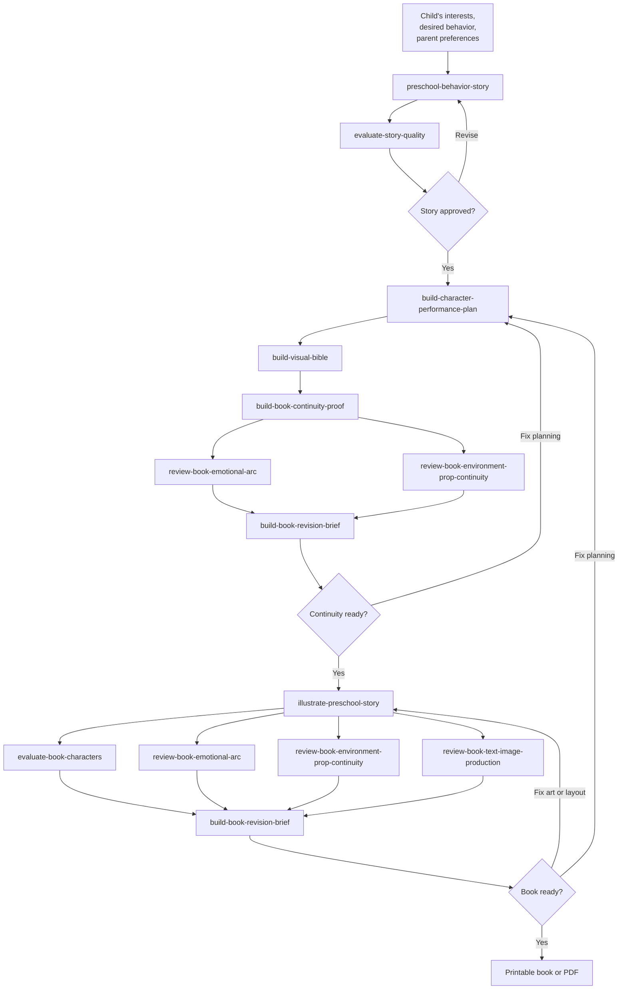

# Children's-book skill workflow

This is the canonical map of how the reusable skills in this repository fit
together. Arrows show the usual artifact handoff, not a requirement to run
every optional review on every iteration.

## Keeping this map current

When adding, removing, renaming, or changing the inputs, outputs, or routing of
a skill under `.agents/skills/`, update this diagram in the same change. Check
the affected `SKILL.md` contracts rather than inferring the flow from directory
names, represent every repository skill at least once, and keep review loops and
approval gates explicit.
