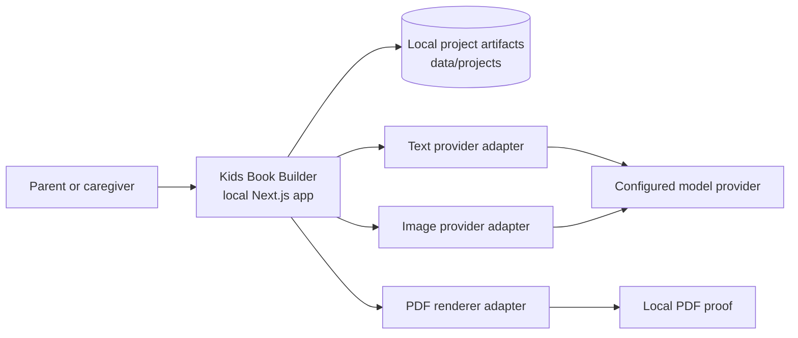
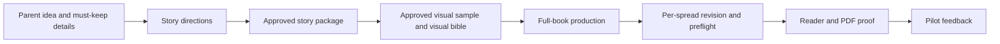
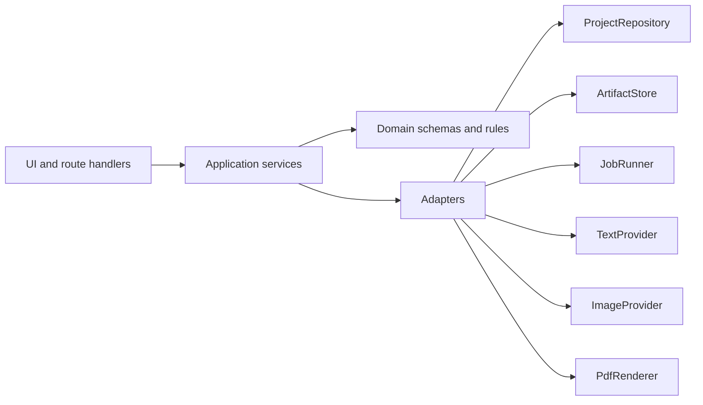
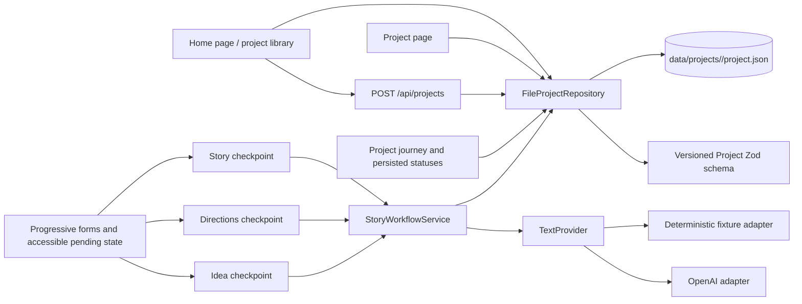

# Architecture

**Status: V0 build in progress.** This is the living, navigable map of Kids Book
Builder. It starts at system level and links to the canonical product,
implementation, and verification details as they are introduced. Update it when
a pull request changes an architectural boundary or other documented system
behavior; see [AGENTS.md](AGENTS.md) for the required impact assessment.

## System purpose and V0 boundary

Kids Book Builder is a local-first application that helps a parent or caregiver
turn an original idea into a personalized illustrated children's book. V0 runs
on one developer laptop and stores projects locally. It deliberately excludes
accounts, shared infrastructure, staging, and production hosting.

The authoritative V0 product decisions and research are indexed in
[spec/README.md](spec/README.md). The active delivery plan is
[tasks/mlp-v0.md](tasks/mlp-v0.md).

## System context

Provider integrations are planned seams, not yet a reason to couple UI or domain
logic to an SDK. The provider, filesystem, clock, and ID boundaries are defined
in [development.md](development.md).

## Product flow

Parent approval is a system boundary: downstream work must preserve approved
details unless the parent explicitly reopens the decision. Artifact lifecycle,
staleness, and provenance requirements are specified in
[development.md](development.md) and will be implemented in the domain model.

## Application architecture

Dependency direction is one-way: UI/routes call application services; application
services coordinate domain rules and adapters; provider SDKs and filesystem
details remain inside adapters. This is the canonical high-level representation
of the code boundaries defined in [development.md](development.md).

## Current implementation status

Foundation, local project storage, and the text-only approval flow are runnable.
A parent can create and reopen a project, save an idea, iterate on directions,
select one, revise a 13-spread story, and persist approval. The current data
flow is:

`FileProjectRepository` performs validated reads and atomic writes. Briefs,
direction revisions, selected direction, story revisions, and approval
decisions are schema-versioned JSON artifacts. `StoryWorkflowService` owns the
text workflow; routes do not import the OpenAI SDK. A shared project journey
derives ordered checkpoint statuses and the next recovery action from validated
artifacts. `StoryWorkflowService` persists a versioned text-generation job
before provider work and records its completed or failed terminal state while
preserving the last safe artifact. Progressive forms use a small JSON response contract to keep
accessible pending feedback visible while server work runs, then navigate to
the saved result or recovery page. Playwright runs an isolated fixture-provider
server on port 3100 with both its build and project data under test-only paths,
so automated checks cannot reuse a live provider-configured development server
or write into the parent's project library. General dependency staleness,
per-unit job progress and resume/stop controls, visual providers, and the remaining book workflow are
planned slices. The
authoritative task status and evidence remain in
[tasks/mlp-v0.md](tasks/mlp-v0.md), rather than being duplicated here.

## Architectural invariants

- Product and domain rules do not depend on Next.js, React, local files, or an
  OpenAI SDK.
- All untrusted boundaries are validated; persisted artifacts are schema-versioned.
- Local project data and secrets are not committed to Git.
- Normal verification does not call paid model APIs.
- Approved work is preserved through successor artifacts and explicit staleness.
- Automated tests establish correctness; parent review establishes product
  acceptance.

## Detail map

| Concern                                               | Canonical detail                                     |
| ----------------------------------------------------- | ---------------------------------------------------- |
| Product research, decisions, and terminology          | [spec/README.md](spec/README.md)                     |
| Parent-facing interaction contract                    | [spec/08-ux-guidelines.md](spec/08-ux-guidelines.md) |
| Quality gates, setup, architecture seams, and testing | [development.md](development.md)                     |
| Agent delivery workflow and context model             | [agenticsdlc.md](agenticsdlc.md)                     |
| Current feature/task status                           | [tasks/mlp-v0.md](tasks/mlp-v0.md)                   |
| Durable non-obvious decisions                         | `spec/adr/` when introduced                          |
| Executable behavior                                   | Source, Zod schemas, and tests                       |

## Architecture change log

| Date       | Change                                                                                                             | Evidence                                                                      |
| ---------- | ------------------------------------------------------------------------------------------------------------------ | ----------------------------------------------------------------------------- |
| 2026-07-20 | Established the living V0 architecture map and architecture-impact policy.                                         | `AGENTS.md`, `agenticsdlc.md`                                                 |
| 2026-07-20 | Added the local project-library boundary: create, list, and reopen versioned `project.json` artifacts.             | `src/lib/projects/`, `e2e/home.spec.ts`, `tasks/mlp-v0.md`                    |
| 2026-07-20 | Added the parent-facing interaction contract for durable state, generation recovery, approvals, and accessibility. | `spec/08-ux-guidelines.md`, `AGENTS.md`                                       |
| 2026-07-20 | Added the versioned text workflow and an isolated zero-token fixture path for automated browser tests.             | `src/lib/directions/`, `e2e/home.spec.ts`, `playwright.config.ts`             |
| 2026-07-20 | Added the ordered project journey, artifact-derived recovery statuses, and accessible progressive form feedback.   | `src/components/`, `src/lib/projects/project-progress.ts`, `e2e/home.spec.ts` |
