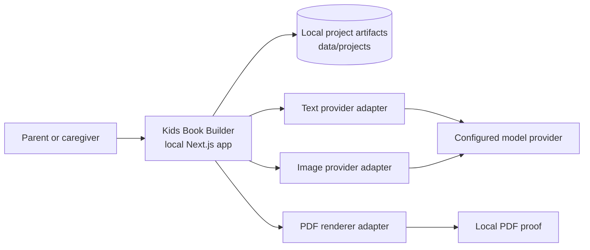
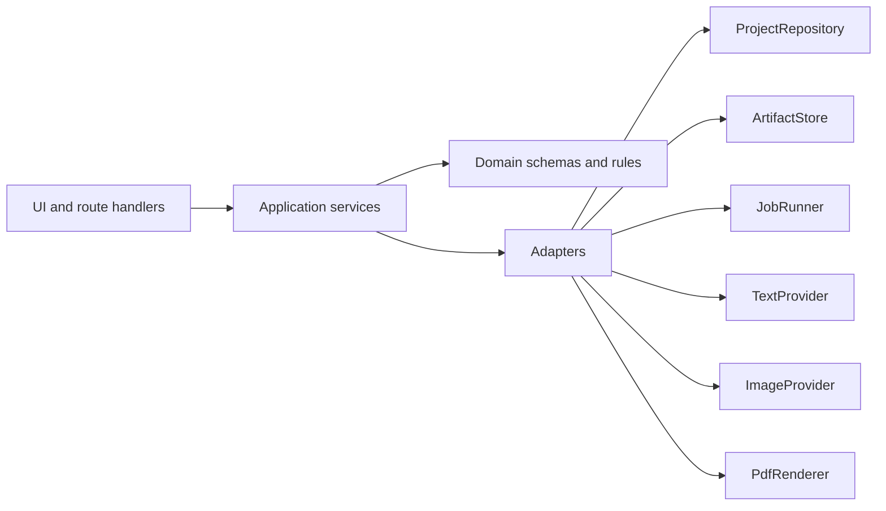
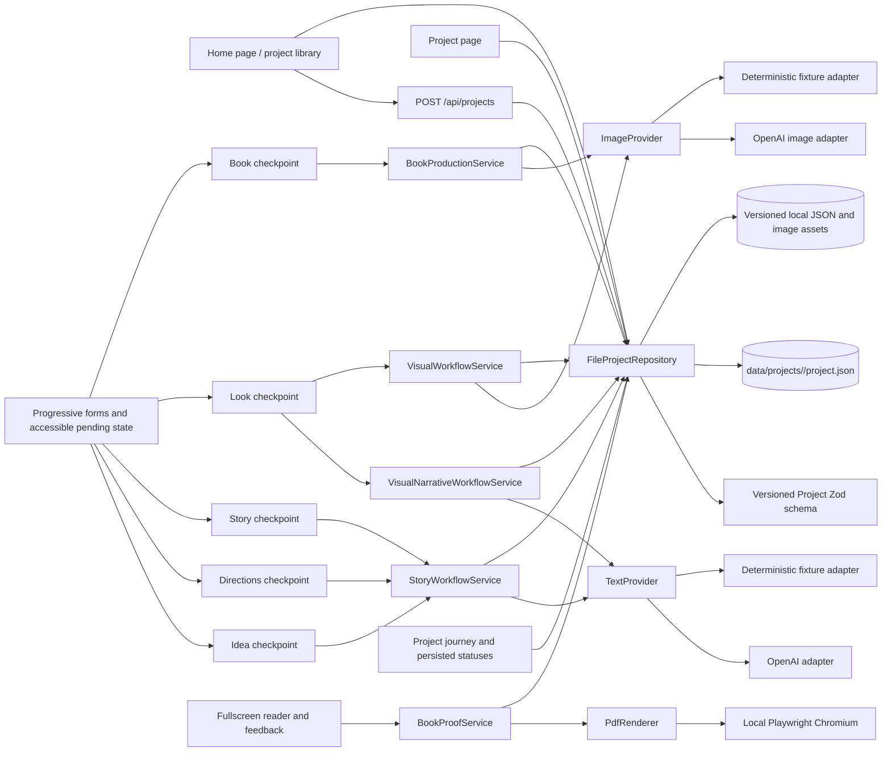

# Architecture

**Status: V0 build in progress.** This is the living, navigable map of Kids Book
Builder. It starts at system level and links to the canonical product,
implementation, and verification details as they are introduced. Update it when
a pull request changes an architectural boundary or other documented system
behavior; see [AGENTS.md](AGENTS.md) for the required impact assessment.

## System purpose and V0 boundary

Kids Book Builder is a local-first application that helps a parent or caregiver
turn an original idea into a personalized illustrated children's book. V0 runs
on one developer laptop and stores projects locally. It deliberately excludes
accounts, shared infrastructure, staging, and production hosting.

The authoritative V0 product decisions and research are indexed in
[spec/README.md](spec/README.md). The active delivery plan is
[tasks/mlp-v0.md](tasks/mlp-v0.md).

## System context

Provider integrations are planned seams, not yet a reason to couple UI or domain
logic to an SDK. The provider, filesystem, clock, and ID boundaries are defined
in [development.md](development.md).

## Product flow

```mermaid
flowchart LR
  Idea[Parent idea and must-keep details] --> Directions[Story directions]
  Directions --> Story[Approved story package]
  Story --> VisualPlan[Approved emotional arc and visual spread plan]
  VisualPlan --> Visual[Approved visual sample and visual bible]
  Visual --> Plan[Zero-cost 16-page book plan]
  Plan --> Approval[Exact plan revision approval]
  Approval --> Production[Full-book production]
  Production --> Revision[Per-spread revision and preflight]
  Revision --> Reader[Reader and PDF proof]
  Reader --> Feedback[Pilot feedback]
```

Parent approval is a system boundary: downstream work must preserve approved
details unless the parent explicitly reopens the decision. Artifact lifecycle,
staleness, and provenance requirements are specified in
[development.md](development.md) and will be implemented in the domain model.

## Application architecture

Dependency direction is one-way: UI/routes call application services; application
services coordinate domain rules and adapters; provider SDKs and filesystem
details remain inside adapters. This is the canonical high-level representation
of the code boundaries defined in [development.md](development.md).

## Current implementation status

Foundation, local project storage, text approval, visual-story planning, the
visual sample gate, full-book production, and the finished proof flow are
runnable. A parent can
create and reopen a project,
save an idea, iterate on directions, select one, revise and approve a 13-spread
story, generate and minimally review a versioned visual spread plan backed by
an internal emotional arc, approve its exact revision, choose a curated art
direction from six bundled same-scene visual previews, regenerate versioned
character-design sets, choose a character reference, review the approved story
text on a sample spread, persist visual approval, inspect
and edit a zero-additional-image-cost contact sheet and wireframe reader,
approve the exact book-plan revision, run or resume sequential production,
revise one saved book page without replacing its siblings, read the exact
approved revisions one spread at a time, export a screen-quality PDF, and save
a local family reflection and pilot summary. The current data flow is:

`FileProjectRepository` performs validated reads and atomic writes. Briefs,
direction revisions, selected direction, story revisions, and approval
decisions are schema-versioned JSON artifacts. Story drafts also pass one hidden
quality evaluation with at most one automatic rewrite before parent review.
`StoryWorkflowService` owns the text workflow; routes do not import the OpenAI
SDK. `VisualNarrativeWorkflowService` owns paired, versioned `EmotionalArc` and
`SpreadMap` generation, bounded parent steering, persisted recovery state, and
exact-revision approval. Parents see only the spread beat, main action,
emotional movement, and relevant must-show detail. `VisualWorkflowService`
requires that approval before character generation and passes the approved
planning artifacts into character and sample image requests. It owns curated
presets, versioned character-option generation and regeneration, reference
selection, the Visual Bible, sample revisions, and visual approval. The
`ImageProvider` boundary has OpenAI and deterministic fixture adapters and
accepts production-page requests containing the approved character reference,
the prior saved page when available, and beat-specific continuity facts.
`BookProductionService` first derives a
versioned 16-page `BookPlan` locally from the current approved story, character
reference, Visual Bible, sample revision, family details, text-safe areas, and
continuity facts. The parent can edit page text, illustration intent, and
must-show details as successor artifacts; an exact-revision decision gates
provider-backed production. The service then owns configurable cost estimates,
the $3 soft-budget presentation and over-$5 confirmation gate, per-page atomic
saves, pause/resume recovery, numbered local page successors, and preflight. A
versioned production job records completed units, last safe output, estimated
spend, failure location, and parent-readable activity events. A process-local
active-run claim prevents duplicate paid requests; the parent view polls the
persisted job and distinguishes a live request from restart recovery.
Binary assets are written atomically and served through a project-scoped,
path-validated route. After page review, one versioned final-book decision
captures the exact current revisions of all 16 pages; any later page successor
makes that approval stale while preserving it. A shared project journey
derives ordered checkpoint statuses and the next recovery action from validated
artifacts. `StoryWorkflowService` persists a versioned text-generation job
before provider work and records its completed or failed terminal state while
preserving the last safe artifact. Progressive forms use a small JSON response contract to keep
accessible pending feedback visible while server work runs, then navigate to
the saved result or recovery page. Playwright runs an isolated fixture-provider
server on port 3100 with both its build and project data under test-only paths,
so automated checks cannot reuse a live provider-configured development server
or write into the parent's project library. Pull-request UI review runs that
same fixture-only suite with a read-only checkout token, uploads authenticated
Playwright reports, screenshots, traces, and videos for 14 days, then links the
artifact from a separate comment job that never checks out or executes pull
request code. `BookProofService` gates the reader and export on the current
exact-revision complete-book approval, serializes the shared reader layout into
a versioned HTML proof, and delegates PDF creation to `PdfRenderer`. The local
Playwright adapter verifies 16 rendered pages and rejects overflowing text
before a landscape PDF is saved. Versioned reading feedback remains local and
produces a validated pilot summary from persisted project, job, proof, and
family-session signals. General dependency staleness remains a planned slice.
The authoritative task status and evidence remain in
[tasks/mlp-v0.md](tasks/mlp-v0.md), rather than being duplicated here.

## Architectural invariants

- Product and domain rules do not depend on Next.js, React, local files, or an
  OpenAI SDK.
- All untrusted boundaries are validated; persisted artifacts are schema-versioned.
- Local project data and secrets are not committed to Git.
- Normal verification does not call paid model APIs.
- Approved work is preserved through successor artifacts and explicit staleness.
- Automated tests establish correctness; parent review establishes product
  acceptance.

## Detail map

| Concern                                               | Canonical detail                                           |
| ----------------------------------------------------- | ---------------------------------------------------------- |
| Product research, decisions, and terminology          | [spec/README.md](spec/README.md)                           |
| Parent-facing interaction contract                    | [spec/08-ux-guidelines.md](spec/08-ux-guidelines.md)       |
| Artifact ownership, lineage, storage, and status      | [spec/09-artifact-catalog.md](spec/09-artifact-catalog.md) |
| Quality gates, setup, architecture seams, and testing | [development.md](development.md)                           |
| Agent delivery workflow and context model             | [agenticsdlc.md](agenticsdlc.md)                           |
| Current feature/task status                           | [tasks/mlp-v0.md](tasks/mlp-v0.md)                         |
| Durable non-obvious decisions                         | `spec/adr/` when introduced                                |
| Executable behavior                                   | Source, Zod schemas, and tests                             |

## Architecture change log

| Date       | Change                                                                                                                                                                                                                                     | Evidence                                                                                                    |
| ---------- | ------------------------------------------------------------------------------------------------------------------------------------------------------------------------------------------------------------------------------------------ | ----------------------------------------------------------------------------------------------------------- |
| 2026-07-20 | Established the living V0 architecture map and architecture-impact policy.                                                                                                                                                                 | `AGENTS.md`, `agenticsdlc.md`                                                                               |
| 2026-07-20 | Added the local project-library boundary: create, list, and reopen versioned `project.json` artifacts.                                                                                                                                     | `src/lib/projects/`, `e2e/home.spec.ts`, `tasks/mlp-v0.md`                                                  |
| 2026-07-20 | Added the parent-facing interaction contract for durable state, generation recovery, approvals, and accessibility.                                                                                                                         | `spec/08-ux-guidelines.md`, `AGENTS.md`                                                                     |
| 2026-07-20 | Added the versioned text workflow and an isolated zero-token fixture path for automated browser tests.                                                                                                                                     | `src/lib/directions/`, `e2e/home.spec.ts`, `playwright.config.ts`                                           |
| 2026-07-20 | Added the ordered project journey, artifact-derived recovery statuses, and accessible progressive form feedback.                                                                                                                           | `src/components/`, `src/lib/projects/project-progress.ts`, `e2e/home.spec.ts`                               |
| 2026-07-21 | Added hidden story evaluation and the visual sample gate with curated presets, image-provider adapters, regenerable versioned character sets and references, a Visual Bible, separately rendered story text, and explicit visual approval. | `src/lib/visuals/`, `src/app/projects/[projectId]/look/`, `e2e/home.spec.ts`, `tasks/mlp-v0.md`             |
| 2026-07-22 | Added resumable sequential full-book production with cost gates, per-page reference and continuity inputs, atomic progress, local page revision, activity history, and production preflight.                                               | `src/lib/production/`, `src/app/projects/[projectId]/book/`, `e2e/home.spec.ts`, `tasks/mlp-v0.md`          |
| 2026-07-22 | Added a locally derived 16-page contact sheet and wireframe reader, versioned page-plan edits, and exact-plan approval before provider-backed production.                                                                                  | `src/lib/production/`, `src/app/projects/[projectId]/book/`, `spec/mlp-v0-plan.md`, `e2e/home.spec.ts`      |
| 2026-07-22 | Added authenticated, 14-day Playwright PR review artifacts and an idempotent same-repository PR comment from a token-isolated job.                                                                                                         | `.github/workflows/pr-ui-review.yml`, `playwright.config.ts`                                                |
| 2026-07-22 | Added exact-revision HTML/PDF proofs, a shared fullscreen reader layout, local Playwright export with overflow rejection, versioned reading feedback, and derived pilot summaries.                                                         | `src/lib/proof/`, `src/app/projects/[projectId]/book/read/`, `e2e/home.spec.ts`, `tasks/mlp-v0.md`          |
| 2026-07-27 | Added a contributor-facing catalog of implemented artifact ownership, lineage, storage conventions, approval boundaries, lifecycle gaps, and proposed visual-narrative boundaries.                                                         | `spec/09-artifact-catalog.md`, `spec/README.md`                                                             |
| 2026-08-01 | Kept story-text revision in Step 3, removed sample-only text editing from Step 4, and clarified the parent-facing visual-approval handoff.                                                                                                 | `src/lib/visuals/`, `src/app/projects/[projectId]/look/`, `spec/09-artifact-catalog.md`, `e2e/home.spec.ts` |
