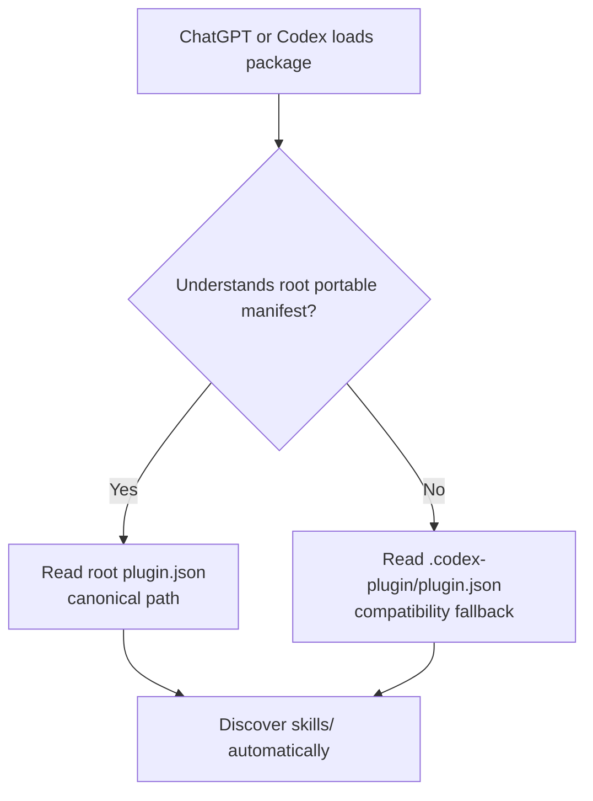

# Kids Book Gen Studio plugin package

`plugin.json` at this directory's root is the canonical manifest. It owns the
plugin identity, publisher metadata, portable component discovery, and OpenAI
presentation metadata under `extensions.com.openai`.

`.codex-plugin/plugin.json` is a compatibility fallback for a host that only
understands the older Codex package layout. It is not a second plugin and it
must never have a different name or version. A current host reads the OpenAI
metadata from the root manifest and ignores the fallback overlay.

The fallback can be removed after every supported installation and validation
path understands the portable manifest. Until then it is retained to test the
same package with older ingestion paths.

## Brand assets

- `assets/logo.png` is the 1024 × 1024 marketplace logo.
- `assets/composer-icon.png` is the 256 × 256 small-surface icon.
- Both files use the same transparent, text-free mark so it remains recognizable
  at small sizes.
