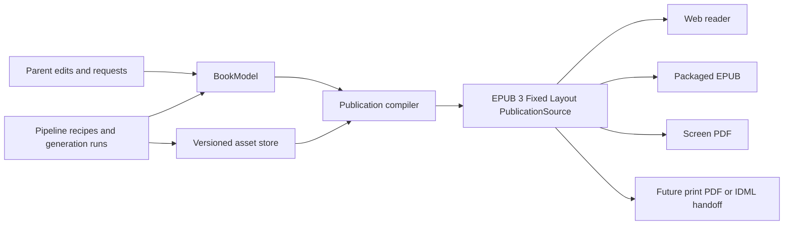

# Proposed Two-Layer Book Source Architecture

**Proposal:** DP-0002

**Type:** Architecture

**Status:** Proposed for product and architecture review

**Discussion:** [PR #12](https://github.com/bhadrip/kids-book-gen/pull/12)

**Resolution:** Pending

**Decision requested:** Whether the durable editable book should separate a
product-specific semantic `BookModel` from a standards-based EPUB 3 Fixed
Layout `PublicationSource`

**Last updated:** 2026-07-22

## Summary

The
[artifact-first book experience proposal](../0001-artifact-first-book-experience/proposal.md)
argues that the durable product should be an editable book rather than a
record that can only be continued by replaying its original generation
pipeline. This proposal refines the technical meaning of that editable book.

The book has two distinct source models:

1. **`BookModel`:** a custom, validated domain model for family intent, story,
   characters, behavior, manuscript, visual intent, continuity, approvals, and
   provenance.
2. **`PublicationSource`:** a standards-based spatial publication made from
   EPUB 3 Fixed Layout XHTML, CSS, SVG, fonts, and linked image assets.

Versioned illustration files, character references, fonts, and output
renditions form an asset store used by both models. The asset store is a
storage concern rather than a third competing source of book semantics.

The application should invent the product-specific `BookModel`, but it should
not invent a proprietary page-layout language when EPUB already provides an
open, validated model for fixed-layout digital picture books.

## Decision context

The current repository stores semantic and presentational facts across a brief,
story package, Visual Bible, book plan, page artifacts, image assets, proof
HTML, and proof metadata. This is sufficient for the prototype, but the
artifact-first direction raises two questions:

- Which representation is authoritative when a parent edits story content?
- Which representation is authoritative when a parent changes page layout or
  replaces an illustration?

A single custom `BookSource` could answer both questions, but it would combine
story semantics with a homegrown page-description language. Conversely, using
only XHTML would discard product concepts such as character behavior, parent
must-keeps, story causality, continuity, and artifact provenance.

The proposed boundary assigns a clear responsibility to each layer.

| Concern                                     | Authority                                 |
| ------------------------------------------- | ----------------------------------------- |
| Family intent and exclusions                | `BookModel`                               |
| Character identity and behavior             | `BookModel`                               |
| Manuscript and story structure              | `BookModel`                               |
| Illustration intent and continuity          | `BookModel`                               |
| Physical page order and spread grouping     | `PublicationSource`                       |
| Text and image frames                       | `PublicationSource`                       |
| Typography and visual layering              | `PublicationSource`                       |
| Crop, focal point, and placed rendition     | `PublicationSource`                       |
| Source image binaries and output renditions | Asset store                               |
| Generation history and approvals            | Project artifacts referencing both layers |

## Research basis

### EPUB is a web-native publication standard

[EPUB 3.3](https://www.w3.org/TR/epub-33/) is a W3C distribution and
interchange standard for publications. An EPUB package can contain XHTML, CSS,
SVG, fonts, images, and other resources while defining a default reading order
through its package spine.

EPUB Fixed Layout marks the publication as `pre-paginated`, gives content
documents explicit viewport dimensions, and preserves intentional page
composition. Apple documents fixed-layout EPUB as appropriate for highly
designed publications such as children's picture books, including full-bleed
images and text positioned over images using CSS. See the
[Apple fixed-layout overview](https://help.apple.com/itc/booksassetguide/en.lproj/itcd7c4daa88.html)
and [document setup guidance](https://help.apple.com/itc/booksassetguide/en.lproj/itc250e186b9.html).

### EPUB is not the only publishing source format

Professional print designers commonly work in desktop-publishing tools.
Adobe's IDML is an XML-based format for manipulating InDesign documents and
their contents. It is valuable for professional handoff, but using it as the
application's native source would introduce a tool-oriented, Adobe-shaped
document model. See the
[Adobe InDesign developer overview](https://developer.adobe.com/indesign/).

HTML/CSS paged-media engines are another credible publishing path. W3C CSS
Paged Media defines page boxes, page size, orientation, margins, and paginated
output. Tools such as Vivliostyle compile HTML and CSS into PDF and EPUB. See
[CSS Paged Media](https://www.w3.org/TR/css-page-3/) and the
[Vivliostyle documentation](https://docs.vivliostyle.org/en/).

These tools reinforce the proposed separation: XHTML/CSS is a useful
publication and rendering language, while story semantics belong in another
model.

### The traditional picture-book dummy is a complete publication preview

Picture-book production commonly uses a dummy containing the full paginated
story, rough sketches throughout, and a small number of representative finished
illustrations. SCBWI's work-in-progress grant requirements describe a rough
dummy containing the entire text, sketches for the complete book, and two
finished illustrations. See the
[SCBWI dummy requirements](https://www.scbwi.org/awards-and-grants/for-illustrators/don-freeman-work-in-progress-grant).

The proposed `PublicationSource` is the digital, structured equivalent of that
dummy. The page structure and text remain stable while placeholder, rough, and
final illustration renditions replace one another.

### Print delivery is a compilation target

Print services typically accept a flattened, constrained PDF rather than the
original editable layout. For example, KDP requires PDF for full-bleed
interiors, requires single physical pages rather than two-up spread files, and
recommends images at 300 DPI. See the
[KDP paperback submission guidelines](https://kdp.amazon.com/en_US/help/topic/G201857950).

EPUB does not fully model print concerns such as printer-specific bleed,
gutter, CMYK conversion, or PDF/X conformance. Those belong in an output profile
and preflight adapter rather than in a second semantic representation of the
book.

## Proposed system model



Pipeline recipes and generation runs describe how revisions were created. They
do not replace either source model.

## Layer 1: custom `BookModel`

`BookModel` represents what the book means and what must remain true when it is
edited. It should be versioned, schema-validated, and independent of React,
XHTML, CSS, filesystems, and provider SDKs.

```yaml
book:
  schema_version: 1
  id: book_123
  revision: 4

  audience:
    age_range: [7, 10]
    reading_mode: parent_read_aloud
    language: en

  family_intent:
    original_idea: A child and their dog build a moon garden.
    must_keep:
      - Grandma's red bicycle
    avoid: []

  characters:
    - id: maya
      name: Maya
      story_role: protagonist
      desire: Build a garden that glows at night.
      behavior:
        strengths: [curious, persistent]
        growth_edge: asks_for_help
      visual_invariants:
        - yellow round glasses
        - green satchel

  story:
    promise: Maya's failed experiments reveal what moon seeds need.
    arc:
      beginning: ...
      middle: ...
      ending: ...

  spreads:
    - id: spread_07
      function: difficult_choice
      beat: Maya decides whether to admit that she tore the kite.
      text: Maya tucked the torn corner behind her green satchel.
      characters_present: [maya]
      illustration_intent: Maya avoids her friend's gaze near the torn kite.
      must_show: [torn kite, green satchel]
      continuity_facts:
        - The kite is torn in the lower-left corner.
```

The schema sketch is illustrative. A follow-up engineering design must decide
whether `BookModel` is one canonical aggregate or a validated projection over
the repository's existing brief, story, Visual Bible, and book-plan artifacts.
It must not introduce duplicated authorities for the same field.

### `BookModel` owns

- Audience and reading mode
- Original family input, must-keeps, and exclusions
- Character identity, motivation, behavior, and emotional change
- Story structure, manuscript, and page-level story purpose
- Illustration intent, must-show details, and continuity facts
- Content dependencies and staleness
- Parent content decisions
- Content-generation provenance

### `BookModel` does not own

- CSS selectors or declarations
- Pixel or point coordinates
- Font file placement
- Image crops and rendered sizes
- EPUB package paths
- Browser implementation details
- PDF printer settings

## Layer 2: EPUB 3 Fixed Layout `PublicationSource`

`PublicationSource` represents the current editable spatial publication. It is
stored as an unpacked EPUB-compatible directory so individual XHTML, CSS, and
asset changes remain inspectable and versionable.

```text
publication/
  mimetype
  META-INF/
    container.xml
  EPUB/
    package.opf
    nav.xhtml
    styles/
      book.css
    pages/
      cover.xhtml
      page-001.xhtml
      page-002.xhtml
      page-003.xhtml
    assets/
      images/
      fonts/
      svg/
```

The packaged `.epub` file is a rendition of this directory, not the only stored
copy of the publication source.

### Constrained EPUB profile

V0 should support a deliberately small, deterministic EPUB profile:

- EPUB 3 Fixed Layout with `rendition:layout` set to `pre-paginated`
- One XHTML content document per physical page
- Explicit, consistent viewport dimensions
- Package spine as the authoritative physical reading order
- Explicit left/right/center page-spread semantics
- XHTML, CSS, SVG, supported image resources, and embedded fonts
- Separate selectable text, not ordinary manuscript text baked into images
- Paragraph- or sentence-level positioned text frames
- No publication JavaScript
- No remote resources
- No arbitrary iframe or executable content
- A tested subset of CSS positioning, sizing, typography, transforms, and
  layering

JavaScript remains available to the application editor and reader shell. It is
not part of the durable publication contract.

### Example physical page

```xhtml
<?xml version="1.0" encoding="UTF-8"?>
<!DOCTYPE html>
<html xmlns="http://www.w3.org/1999/xhtml" lang="en">
  <head>
    <meta charset="UTF-8" />
    <meta name="viewport" content="width=1536,height=1024" />
    <title>Story page 7</title>
    <link rel="stylesheet" href="../styles/book.css" />
  </head>
  <body>
    <article
      id="page-017"
      class="book-page story-page"
      data-book-content-ref="spread_07"
    >
      
      <p class="story-text" data-book-content-ref="spread_07.text">
        Maya tucked the torn corner behind her green satchel.
      </p>
    </article>
  </body>
</html>
```

```css
html,
body,
.book-page {
  width: 1536px;
  height: 1024px;
  margin: 0;
  overflow: hidden;
}

.book-page {
  position: relative;
}

.illustration {
  position: absolute;
  inset: 0;
  width: 100%;
  height: 100%;
  object-fit: cover;
}

.story-text {
  position: absolute;
  inset-inline-start: 8%;
  inset-block-start: 10%;
  width: 34%;
  margin: 0;
  font:
    34px/1.35 "Book Serif",
    serif;
  color: #2b2118;
}
```

The `data-book-*` attributes bind publication nodes to stable domain and asset
identifiers without changing how conforming reading systems render the XHTML.

## Asset store

Illustrations are linked resources, not XHTML and not fields embedded as base64
inside `BookModel`.

```text
assets/
  character-references/
    maya-r2.png
  sources/
    spread-07-r2.png
  renditions/
    preview/
      spread-07-r2.webp
    epub/
      spread-07-r2.jpeg
    print/
      spread-07-r2.tif
  masks/
    spread-07-r2-repair.png
```

One logical asset may have multiple renditions:

```yaml
asset:
  id: illustration_spread_07
  revision: 2
  source: assets/sources/spread-07-r2.png
  renditions:
    preview: assets/renditions/preview/spread-07-r2.webp
    epub: assets/renditions/epub/spread-07-r2.jpeg
    print: assets/renditions/print/spread-07-r2.tif
  provenance:
    generation_run: image_run_42
```

The publication references the appropriate rendition for its output profile.
Replacing a preview rendition must not change the identity of the logical
illustration or delete the source revision.

EPUB resources cannot resolve outside the package. When compiling a publication
revision, the application copies or safely links the selected project-level
renditions into `EPUB/assets/` and records the mapping back to their stable
asset IDs. The package copy is disposable; the versioned project asset remains
authoritative.

## Authority and synchronization

The central rule is:

> `BookModel` is authoritative for content and meaning. `PublicationSource` is
> authoritative for layout and presentation.

The XHTML necessarily materializes manuscript text so that the EPUB remains
readable and accessible. That does not make it a second authority for the text.

### Content edit


A direct text edit in the parent UI updates `BookModel` first. The compiler then
updates every XHTML node bound to the changed content identifier.

### Layout edit

Moving or resizing a text frame creates a `PublicationSource` successor without
changing `BookModel`. The XHTML text must still match the bound domain field.

### Illustration replacement

Generating or selecting a new illustration creates an asset successor and then
a `PublicationSource` successor that references it. Story semantics remain
unchanged unless the parent also changed illustration intent or continuity.

### Broad semantic change

Changing a protagonist, setting, or ending creates a `BookModel` successor. The
dependency graph identifies affected pages and assets. The application compiles
a complete inexpensive publication preview before asking to regenerate paid
illustrations.

## Revision relationship

Both layers have independent revisions linked explicitly:

```yaml
publication_revision:
  id: publication_r8
  source_format: epub_3_fixed_layout
  derived_from_book_revision: book_r4
  changed_pages: [page-017]
  created_at: 2026-07-22T21:00:00Z
```

If `BookModel` advances to revision 5, publication revision 8 is stale until all
affected bindings are compiled. Unaffected XHTML pages and assets are
preserved.

A validation step must detect:

- Bound XHTML text that disagrees with `BookModel`
- Missing domain or asset references
- Duplicate stable identifiers
- XHTML pages absent from the package spine
- Spine items without corresponding physical-page records
- Invalid or unavailable asset renditions
- Text overflow and unsafe placement
- EPUB conformance failures

[EPUBCheck](https://www.w3.org/publishing/epubcheck/) is the official EPUB
conformance checker and should validate packaged EPUB output. Domain bindings,
layout overflow, and project provenance require additional application tests.

## Physical pages and spreads

The canonical publication unit should be a physical page. A spread is a
relationship between facing pages, not a replacement for them.

```yaml
spread:
  id: story_spread_07
  left_page: page-016
  right_page: page-017
```

This supports:

- EPUB spine order
- Odd/even and left/right page semantics
- Front and back matter
- Reader spread presentation
- Single-page print delivery
- Gutter and bleed checks

An illustration may visually cross the gutter, but both physical page
identities remain explicit. An export adapter may crop a shared spread asset
into two print pages while retaining the shared logical illustration ID.

## Rendering and export

```text
BookModel + versioned assets
              |
              v
    EPUB Fixed Layout source
       |       |       |
       v       v       v
  Web reader  .epub  Screen PDF
                          |
                          v
                 Future print output
```

### Web reader

The application can render the XHTML pages directly inside its reader shell.
Reader controls and editing affordances remain application UI outside the page
document.

### EPUB

The application packages the publication directory according to EPUB container
rules and validates it with EPUBCheck. The same content can later be tested in
target reading systems.

### Screen PDF

The current Chromium/Playwright renderer can load the publication pages in
spine order and print them using deterministic screen-PDF settings.

### Future print output

Print requires a separate output profile containing trim, bleed, gutter,
resolution, color, and printer-specific constraints. The adapter compiles the
same publication source into the required single-page PDF form.

If professional designers become a user group, an IDML export adapter can
translate the current publication into an editable InDesign handoff. IDML is a
future integration, not a V0 source dependency.

## Why not use only XHTML

XHTML is well suited to presenting a page, but it cannot safely replace the
domain model. An XHTML-only project would have no stable, validated home for:

- Character goals, behavior, and emotional arc
- Parent-approved must-keeps and exclusions
- Story causality and page function
- Illustration intent and continuity facts
- Dependency and staleness rules
- Model, prompt, and pipeline provenance

Encoding these as arbitrary HTML attributes would create a proprietary domain
language hidden inside the publication format.

## Why not use only a custom JSON layout

A custom JSON page language would initially be simple, but the project would
have to define and maintain equivalents for:

- Page and spine ordering
- Text and image semantics
- Font and stylesheet relationships
- Accessibility markup
- Digital publication packaging
- Reading-system interoperability
- Validation tooling

Using a constrained EPUB profile keeps product semantics custom while reusing
standards for presentation.

## Proposed V0 scope

1. Define a versioned `BookModel` schema by composing or projecting the current
   brief, story, visual, plan, and page data.
2. Define the supported EPUB 3 Fixed Layout profile and CSS subset.
3. Generate an unpacked publication directory with package metadata,
   navigation, spine, one XHTML document per physical page, CSS, and linked
   assets.
4. Bind XHTML content and images to stable domain and asset identifiers.
5. Render the current web reader and screen PDF from the publication source.
6. Preserve separate text and image layers.
7. Support placeholder, rough, and final image renditions without changing page
   identity.
8. Validate domain bindings, physical-page order, asset references, overflow,
   and packaged EPUB conformance.
9. Persist independent book and publication revisions with explicit derivation
   and staleness.

### Explicitly out of scope for V0

- Arbitrary JavaScript in publications
- Full EPUB interactivity or media overlays
- Free-form CSS entered by parents or models
- General-purpose visual design tool
- Print PDF/X certification and color-management workflow
- IDML import or round-trip editing
- Reflowable EPUB
- Multiple trim profiles from one publication
- Professional prepress or printer integration

## Migration from the prototype

No external customers currently depend on the stored prototype format. The
implementation may choose one of two bounded approaches:

1. Discard existing local prototype projects and make the new schemas the clean
   V0 baseline.
2. Provide a development-only converter that maps the current brief, story,
   Visual Bible, book plan, page artifacts, and assets into `BookModel` and
   `PublicationSource` revision 1.

The converter must not become a promise to support every future historical
format. Once customer data exists, schema migrations and compatibility policy
become required product behavior.

## Risks and mitigations

| Risk                                                 | Mitigation                                                                                               |
| ---------------------------------------------------- | -------------------------------------------------------------------------------------------------------- |
| EPUB reading systems render CSS differently          | Define and test a constrained CSS profile against named target readers.                                  |
| Chromium and EPUB readers produce different geometry | Use explicit viewports, deterministic fonts, visual fixtures, and target-specific conformance tests.     |
| Materialized XHTML text drifts from `BookModel`      | Stable bindings and a required equality validator fail the build or save.                                |
| Book semantics leak into custom XHTML conventions    | Limit extension attributes to stable references; retain behavior and story facts in `BookModel`.         |
| EPUB does not cover professional print requirements  | Treat print as an output adapter with a separate profile and preflight contract.                         |
| `BookModel` duplicates the existing artifact graph   | Decide one authority per field and implement the model as an aggregate or projection, not a second copy. |
| External standard complexity slows V0                | Support the smallest valid fixed-layout profile and defer optional EPUB features.                        |

## Decisions requested from review

1. Is EPUB 3 Fixed Layout the correct V0 publication-source standard, or is the
   immediate goal sufficiently print-oriented to justify another format?
2. Should `BookModel` be a new canonical aggregate or a validated projection of
   the existing artifact graph?
3. Should `PublicationSource` be persisted as an editable source revision, or
   regenerated deterministically from a smaller layout model on every build?
4. Which CSS features are required for the six curated visual directions and
   editable text layouts?
5. Is one XHTML document per physical page acceptable even when an illustration
   spans a two-page spread?
6. Which reading systems, if any, must V0 validate in addition to the local web
   reader and EPUBCheck?
7. Should packaged EPUB export be part of V0 user scope, or should V0 only use
   the standard internally while continuing to expose screen PDF?

## Architecture impact if accepted

**Updated.** Implementing this proposal would introduce a new durable domain
contract, an EPUB publication-source boundary, a compilation and binding
contract, and additional validation responsibilities. Acceptance would require
updates to:

- [ARCHITECTURE.md](../../ARCHITECTURE.md)
- [Artifact-first book experience](../0001-artifact-first-book-experience/proposal.md)
- [Agent pipeline](../../spec/04-agent-pipeline.md)
- [Product configuration](../../spec/05-product-configuration.md)
- [Parent experience guidelines](../../spec/08-ux-guidelines.md)
- Project repository and artifact-store interfaces
- Book, publication, asset, generation-run, and proof schemas
- Reader, PDF renderer, and future EPUB export adapters
- Unit, integration, conformance, and parent-visible Playwright evidence

This design-only proposal does not itself change runtime architecture.

## Standards and practice references

- [W3C EPUB 3.3](https://www.w3.org/TR/epub-33/)
- [W3C EPUBCheck](https://www.w3.org/publishing/epubcheck/)
- [Apple fixed-layout book overview](https://help.apple.com/itc/booksassetguide/en.lproj/itcd7c4daa88.html)
- [Apple fixed-layout document setup](https://help.apple.com/itc/booksassetguide/en.lproj/itc250e186b9.html)
- [Apple fixed-layout text guidance](https://help.apple.com/itc/booksassetguide/en.lproj/itc39e7d91ab.html)
- [W3C CSS Paged Media](https://www.w3.org/TR/css-page-3/)
- [Vivliostyle documentation](https://docs.vivliostyle.org/en/)
- [Adobe InDesign and IDML developer overview](https://developer.adobe.com/indesign/)
- [SCBWI picture-book dummy requirements](https://www.scbwi.org/awards-and-grants/for-illustrators/don-freeman-work-in-progress-grant)
- [KDP paperback submission guidelines](https://kdp.amazon.com/en_US/help/topic/G201857950)
