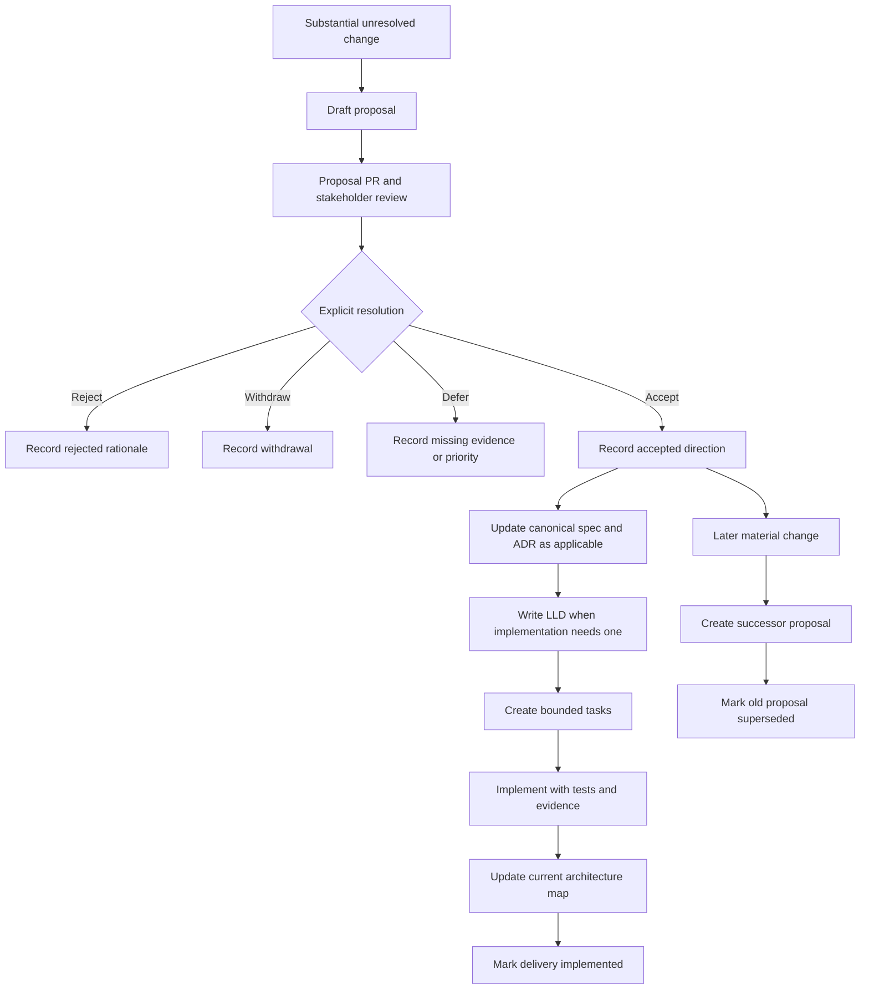

# Proposal-Driven Delivery and Decision History

**Proposal:** DP-0003

**Type:** Process

**Status:** Proposed for product and engineering review

**Discussion:** [PR #12](https://github.com/bhadrip/kids-book-gen/pull/12)

**Resolution:** Pending

**Decision requested:** Whether substantial product and architecture changes
should begin as versioned proposals, receive explicit resolution, and then be
promoted into canonical specifications, ADRs, low-level designs, tasks, and the
implemented architecture map

**Last updated:** 2026-07-22

## Summary

The repository should distinguish the history of considered decisions from the
currently accepted and implemented system.

For a substantial change, the proposed delivery flow is:

```text
Design proposal
    -> review and explicit resolution in a pull request
    -> accepted product specification and/or ADR
    -> low-level design where needed
    -> bounded task breakdown
    -> implementation and executable evidence
    -> update ARCHITECTURE.md to match implemented reality
```

Proposals remain in an append-oriented decision log whether accepted, rejected,
withdrawn, or later superseded. Canonical documents do not accumulate every
alternative; they describe the currently accepted product and system. Source,
schemas, and tests remain the final executable evidence.

This model makes project evolution reconstructable without treating stale
proposals as current requirements.

## Problem

The current repository intentionally treats `spec/` as the source of product
rules and `ARCHITECTURE.md` as the living system map. A large unresolved design
placed directly in `spec/` creates ambiguity:

- Has the direction been accepted, or is it still an idea?
- Does merging its pull request approve the decision or only record it?
- Should implementation agents treat it as binding?
- Where are alternatives and rejection reasons preserved?
- How can a future collaborator determine why the canonical system changed?
- How can a decision be retracted without rewriting history?

Git preserves file revisions, but commit history alone does not supply a clear
decision lifecycle, resolution, owner, relationship to successor decisions, or
mapping from an accepted idea to implementation.

Conversely, keeping all proposals inside canonical specifications would turn
those specifications into chronological notebooks. Agents and humans would
have to infer which paragraphs still apply.

## Research basis

### Python separates proposals from normative specifications

[PEP 1](https://peps.python.org/pep-0001/) defines explicit proposal statuses
such as Draft, Accepted, Rejected, Withdrawn, Final, and Superseded. It states
that version-control history records proposal evolution, but a resolved PEP
becomes a historical document rather than a living specification. Formal
expected behavior is maintained elsewhere in language or library references.

This is the most important precedent for this repository: proposals explain
how a decision was reached; canonical specifications explain what currently
applies.

### Rust separates acceptance from implementation

The [Rust RFC process](https://rust-lang.github.io/rfcs/) reviews substantial
changes through pull requests. Accepted RFCs are not substantially rewritten,
and each accepted RFC receives an implementation tracking issue. Acceptance
therefore records a design decision without claiming that the feature is
already delivered.

This supports separate decision and delivery states in the proposed process.

### ADR practice preserves decisions and supersedes them

[AWS Prescriptive Guidance](https://docs.aws.amazon.com/prescriptive-guidance/latest/architectural-decision-records/adr-process.html)
describes ADR states, review, and a decision log. Once accepted, an ADR becomes
immutable. A materially different decision is recorded in a new ADR that
supersedes the earlier one, preserving the context and consequences of both.

Microsoft's Well-Architected guidance similarly describes the ADR as an
append-only log with statuses such as Proposed, Accepted, and Superseded. See
the
[Azure ADR guidance](https://learn.microsoft.com/azure/well-architected/architect-role/architecture-decision-record).

### Enhancement processes require implementation evidence

Kubernetes uses enhancement proposals for substantial features and couples
them with test plans, production-readiness review, graduation criteria, and
lifecycle tracking. Not every proposal completes implementation. See the
[Kubernetes KEP overview](https://www.kubernetes.dev/resources/keps/) and
[KEP process discussion](https://kubernetes.io/blog/2022/08/11/enhancing-kubernetes-one-kep-at-a-time/).

This supports requiring evidence and bounded delivery tasks after a proposal is
accepted rather than treating acceptance as completion.

## Goals

- Make unaccepted ideas clearly non-canonical.
- Preserve rationale, alternatives, review outcomes, and supersession history.
- Separate decision state from implementation state.
- Give agents an unambiguous path from proposal to executable task.
- Keep `spec/` concise and authoritative for current product rules.
- Keep `ARCHITECTURE.md` truthful about the implemented system.
- Allow future collaborators to trace a behavior back through tasks, designs,
  decisions, and proposals.
- Avoid silently editing or deleting accepted and rejected reasoning.

## Non-goals

- Event-source application or customer data from documentation.
- Reconstruct obsolete binaries, provider models, or external services solely
  from proposal files.
- Require a heavyweight proposal for every small implementation choice.
- Duplicate the same rule across proposals, specifications, ADRs, designs,
  tasks, architecture, and source.
- Make pull-request comments the only durable record of a decision.
- Replace automated tests or product acceptance with document approval.

## “Append-only” and “replay” semantics

The proposal log is append-oriented, not a literal application event store.

It should support **decision replay**: a collaborator can follow stable links
to understand which problem was raised, which alternatives were considered,
what was decided, what superseded it, and which implementation delivered it.

It does not guarantee **runtime replay**. Reproducing a historical runtime also
depends on source commits, dependency locks, migrations, external providers,
assets, configuration snapshots, and executable fixtures.

The trace should allow this traversal:

```text
current behavior
  -> source and tests
  -> implementation PR and task
  -> LLD and accepted ADR/spec
  -> resolved design proposal
  -> superseded or competing proposals
```

Stable proposal identifiers, resolution links, commit history, and explicit
cross-references make this traversal reliable.

## Proposed repository structure

```text
AGENTS.md
development.md
agenticsdlc.md
ARCHITECTURE.md

proposals/
  README.md
  0001-artifact-first-book-experience/
    proposal.md
  0002-two-layer-book-source/
    proposal.md
  0003-proposal-driven-sdlc/
    proposal.md

spec/
  README.md
  <canonical product and domain specifications>
  adr/
    0001-<accepted-architecture-decision>.md

design/
  <accepted low-level implementation designs>

tasks/
  <bounded delivery tasks and evidence>

src/ + tests + schemas
```

### `proposals/`

Historical decision inputs and outcomes. A proposal may be product,
architecture, process, research, or cross-cutting. Its presence does not make
it binding.

### `spec/`

Canonical current product and domain rules. Specifications may link to the
proposal and ADR that explain a rule, but should not copy the proposal's full
debate.

### `spec/adr/`

Accepted architecturally significant choices: context, decision, alternatives,
consequences, status, and supersession. Not every product proposal requires an
ADR.

### `design/`

Accepted low-level designs needed to implement a change: interfaces, schemas,
data flow, failure behavior, migration, rollout, and verification. Small or
obvious changes do not require a separate LLD.

### `tasks/`

Bounded implementation slices with outcomes, scope, acceptance scenarios,
dependencies, and evidence. Acceptance of a proposal does not start broad,
unbounded implementation.

### `ARCHITECTURE.md`

The living map of implemented system boundaries and current planned seams that
the file explicitly labels as planned. It must not describe an accepted but
unimplemented proposal as though it already runs.

## Proposal metadata

Every proposal should begin with:

```yaml
proposal: DP-0004
title: Short outcome-oriented title
type: product | architecture | process | research | cross-cutting
decision_status: proposed
delivery_status: not_applicable
created: 2026-07-22
discussion: pull request or issue URL
resolution: pending
requires: []
supersedes: []
superseded_by: null
resulting_artifacts: []
implementation: []
```

Markdown front matter is illustrative; the repository may use a visible
metadata block if that is easier for humans and tooling.

### Decision status

- **Draft:** not ready for formal review; normally exists only on a branch.
- **Proposed:** ready for decision through the linked review.
- **Deferred:** preserved, but awaiting evidence or priority.
- **Accepted:** approved as intended direction; not necessarily implemented.
- **Rejected:** reviewed and declined with a recorded reason.
- **Withdrawn:** retracted by its owner before acceptance.
- **Superseded:** replaced by a later accepted proposal.

### Delivery status

- **Not applicable:** rejected, withdrawn, or process-only historical record.
- **Not started:** accepted but not decomposed or scheduled.
- **Planned:** accepted and represented in bounded tasks.
- **In progress:** at least one implementation task is active.
- **Implemented:** required behavior and evidence have landed.
- **Abandoned:** accepted work was intentionally stopped before completion.

Decision and delivery state must not be collapsed. “Accepted” must never imply
“available in the product.”

## Proposed lifecycle



### 1. Identify proposal-worthy work

A proposal is warranted when the change includes unresolved choices and affects
one or more of:

- Parent journey or product positioning
- Cross-domain responsibility
- Persistent data or lifecycle
- External integration
- Trust or privacy boundary
- Compatibility or migration policy
- Expensive or difficult-to-reverse production behavior
- A new architectural or dependency pattern

A small bug fix or implementation detail already covered by canonical rules
does not need a proposal.

### 2. Draft the proposal

The author records:

- Problem and evidence
- Goals and non-goals
- Options considered
- Proposed direction
- User and system use cases
- Risks and consequences
- Compatibility and migration implications
- Validation plan
- Open decisions
- Architecture impact if accepted

### 3. Review in a pull request

Prefer one major proposal per PR so the review and resolution remain focused.
Related companion proposals may share a bootstrap PR when their boundaries are
explicit, as DP-0001 through DP-0003 do in PR #12.

PR approval alone means the document is reviewable and may be merged. It does
not determine the proposal outcome unless the designated decision owner
explicitly records acceptance.

Before resolution, relevant conclusions from PR comments must be summarized in
the proposal. PR systems are useful discussion surfaces but are not sufficient
as the only durable rationale.

### 4. Record an explicit resolution

The relevant accountable roles decide:

- PM for product outcome and user behavior
- Engineer or code owner for architecture, security, and migrations
- Both for cross-cutting product and architecture changes

The proposal records the decision status, date, accountable roles,
resolution link, and concise rationale.

A proposal can be merged while still Proposed when the team deliberately wants
an asynchronous repository-visible discussion. It remains non-canonical until
an explicit resolution lands. Rejected and withdrawn proposals should still be
retained so the same debate is not repeated without new evidence.

### 5. Promote accepted decisions into canonical artifacts

“Promotion” does not mean moving or rewriting the proposal. The proposal stays
as history. A follow-up adoption change creates or updates only the canonical
artifacts the decision requires.

| Accepted change                          | Canonical output                             |
| ---------------------------------------- | -------------------------------------------- |
| Product behavior or policy               | Relevant `spec/` document                    |
| Significant architectural choice         | New `spec/adr/` record                       |
| Non-obvious implementation contract      | `design/` LLD                                |
| Delivery work                            | One or more `tasks/` slices                  |
| Implemented boundary or runtime behavior | `ARCHITECTURE.md` update with implementation |

Each canonical artifact links back to the proposal. The proposal records the
resulting artifact links without absorbing their later maintenance.

### 6. Break work into bounded tasks

Each task references:

- Accepted proposal
- Applicable canonical specification
- ADR and LLD, if any
- Observable outcome
- In-scope and out-of-scope behavior
- Acceptance scenarios
- Migration and recovery behavior
- Required evidence

Tasks may sequence prerequisite contracts before UI or provider work. An
accepted proposal can remain unimplemented until tasks are prioritized.

### 7. Implement and update the current map

Implementation PRs update code, schemas, tests, and task evidence. They update
`ARCHITECTURE.md` no later than the PR that changes the corresponding runtime
boundary. The architecture map must not be changed early to describe proposed
behavior as current.

When all required tasks land, update the proposal's delivery metadata to
Implemented and link the implementation PRs or release commit. Do not rewrite
its original rationale.

### 8. Supersede rather than erase

A materially different direction receives a new proposal and, when applicable,
a new ADR. Once accepted:

- Mark the earlier proposal or ADR as Superseded.
- Add bidirectional `supersedes` and `superseded_by` links.
- Update canonical specifications to the new current rule.
- Create migrations and tasks where runtime or persisted data changes.
- Preserve the old proposal, decision, and implementation references.

Resolved proposal bodies are immutable except for minor corrections and
lifecycle metadata or backlinks. Substantive changes require a successor.

## Traceability contract

Every substantial implemented change should support forward and backward
navigation.

### Forward

```text
DP-0001
  -> accepted product specification
  -> ADR-0001
  -> design/artifact-first-book.md
  -> tasks/artifact-first-v0.md
  -> implementation PRs
  -> architecture change-log entry
```

### Backward

```text
failing test or current component
  -> task or architecture detail
  -> LLD/ADR/spec
  -> originating proposal and alternatives
```

Use repository-relative links for local artifacts and permanent URLs for pull
requests. Do not rely solely on branch names because branches may be deleted.

## Relationship to existing repository contracts

If accepted, this process refines rather than replaces the current
[agent-assisted delivery philosophy](../../agenticsdlc.md):

- `AGENTS.md` remains the entry map.
- `development.md` remains the engineering and verification contract.
- `spec/` remains authoritative for current product rules.
- `tasks/` remains authoritative for bounded delivery requests.
- `ARCHITECTURE.md` remains the living map of the implemented system.
- Proposals become the missing non-canonical decision-history layer.

The existing architecture-impact requirement still applies to every PR.

- A proposal-only PR normally has **Architecture impact: None**, because it
  changes no accepted or runtime boundary.
- An adoption PR records the intended impact in specs, ADRs, or LLDs but must
  label unimplemented target behavior clearly.
- An implementation PR updates `ARCHITECTURE.md` when it changes the actual
  system boundary or runtime behavior.

## Automation opportunities

Begin with convention and add checks only after the workflow proves useful.
Potential safeguards include:

- Validate unique, monotonic proposal identifiers.
- Validate required metadata and allowed status transitions.
- Check repository-relative links.
- Require a resolution and rationale for terminal decision states.
- Prevent deletion or renumbering of resolved proposals.
- Require `superseded_by` when status becomes Superseded.
- Verify that accepted proposals link resulting canonical artifacts before
  delivery becomes Planned.
- Verify that Implemented proposals link tasks and implementation evidence.
- Warn when canonical specs cite a Proposed document as authority.
- Generate the proposal index from metadata after the format stabilizes.

CI should not become complex before at least several proposals exercise the
process.

## Applying the process to this PR

PR #12 bootstraps three related proposed decisions:

- DP-0001 proposes the artifact-first parent experience.
- DP-0002 proposes the two-layer book-source architecture.
- DP-0003 proposes this decision and delivery process.

They remain **Proposed** after merge unless the accountable collaborators
explicitly record acceptance. They do not update canonical product rules or
`ARCHITECTURE.md` in this PR.

If DP-0001 and DP-0002 are accepted, follow-up work would:

1. Update the accepted parent-journey specification.
2. Create an ADR for the `BookModel`/EPUB source boundary.
3. Create a low-level schema, compilation, validation, and migration design.
4. Split implementation into bounded, verifiable tasks.
5. Update `ARCHITECTURE.md` with each implemented boundary.

If DP-0003 is accepted, update `AGENTS.md` and `agenticsdlc.md`, add proposal,
ADR, and LLD templates, and consider lightweight validation after the first few
uses.

## Proposed initial scope

1. Add the `proposals/` index and numbered proposal directories.
2. Use visible metadata blocks before introducing a parser or generator.
3. Preserve resolved proposals and supersede them through successors.
4. Require explicit status and resolution independent of PR approval.
5. Promote accepted decisions through follow-up canonical artifacts.
6. Link tasks and implementation PRs back to their accepted decisions.
7. Keep `ARCHITECTURE.md` aligned with implementation rather than aspiration.
8. Revisit the process after three to five resolved proposals.

### Deferred

- Custom proposal-management application
- Automatic documentation site
- Database-backed decision log
- Mandatory proposal for routine changes
- Complex CI status-transition engine
- Automatic generation of ADRs, LLDs, or tasks from proposal prose
- Runtime reconstruction from documentation alone

## Risks and mitigations

| Risk                                                             | Mitigation                                                                         |
| ---------------------------------------------------------------- | ---------------------------------------------------------------------------------- |
| Process overhead slows small changes                             | Define proposal-worthy thresholds and exempt routine bounded work.                 |
| Proposal approval is confused with implementation                | Track decision and delivery status separately.                                     |
| Canonical rules drift from accepted proposals                    | Require explicit promotion links and review canonical artifacts during adoption.   |
| `ARCHITECTURE.md` describes a future that does not exist         | Update it with implementation, or label planned seams explicitly.                  |
| PR comments contain rationale that disappears from local context | Summarize decisive arguments and resolution in the proposal before merge.          |
| Append-only history becomes cluttered                            | Keep a generated or curated status index and concise canonical documents.          |
| Teams edit accepted proposals in place                           | Require successor proposals and immutable resolved bodies.                         |
| Documentation creates a false promise of runtime replay          | State the limits and link source commits, locks, migrations, fixtures, and assets. |
| Multiple artifacts repeat the same rule                          | Assign one source of truth per concern and use links elsewhere.                    |

## Decisions requested from review

1. Should proposals live at repository-root `proposals/` rather than under
   canonical `spec/`?
2. May a still-Proposed document merge for asynchronous discussion, or should
   every proposal PR record a terminal decision before merge?
3. Should one proposal per PR be a rule or a preference?
4. Are separate decision and delivery statuses worth the metadata overhead?
5. Should accepted product changes update `spec/` before implementation, with
   explicit “accepted but not implemented” labeling?
6. Should LLDs live in root `design/`, under `spec/design/`, or beside their
   implementation task?
7. Which roles must approve product, architecture, process, and cross-cutting
   proposals?
8. After how many proposals should metadata validation and index generation be
   automated?

## Acceptance criteria for this process

The process is successful if a new collaborator can:

1. Identify which documents are proposals versus binding current rules.
2. Determine whether a proposal was accepted, rejected, withdrawn, deferred,
   superseded, or implemented.
3. Find the recorded rationale and review resolution.
4. Navigate from a proposal to canonical specs, ADRs, LLDs, tasks, code, tests,
   and architecture changes.
5. Navigate from current behavior back to the decisions that produced it.
6. Propose a materially different direction without deleting the old record.
7. Complete a routine small change without unnecessary proposal ceremony.

## Architecture impact if accepted

**Updated.** The process would change repository ownership boundaries and the
agent delivery workflow. Acceptance would require coordinated updates to:

- [`AGENTS.md`](../../AGENTS.md)
- [`agenticsdlc.md`](../../agenticsdlc.md)
- [`ARCHITECTURE.md`](../../ARCHITECTURE.md) detail map
- [`spec/README.md`](../../spec/README.md)
- Pull-request guidance or template when introduced
- Proposal, ADR, LLD, and task templates
- Optional documentation checks after the convention stabilizes

This proposal-only PR has **Architecture impact: None** because it does not
change accepted process or runtime behavior.

## References

- [Python PEP purpose and lifecycle](https://peps.python.org/pep-0001/)
- [Rust RFC process](https://rust-lang.github.io/rfcs/)
- [AWS architectural decision record process](https://docs.aws.amazon.com/prescriptive-guidance/latest/architectural-decision-records/adr-process.html)
- [Azure architecture decision record guidance](https://learn.microsoft.com/azure/well-architected/architect-role/architecture-decision-record)
- [Kubernetes Enhancement Proposals](https://www.kubernetes.dev/resources/keps/)
- [Enhancing Kubernetes one KEP at a time](https://kubernetes.io/blog/2022/08/11/enhancing-kubernetes-one-kep-at-a-time/)
