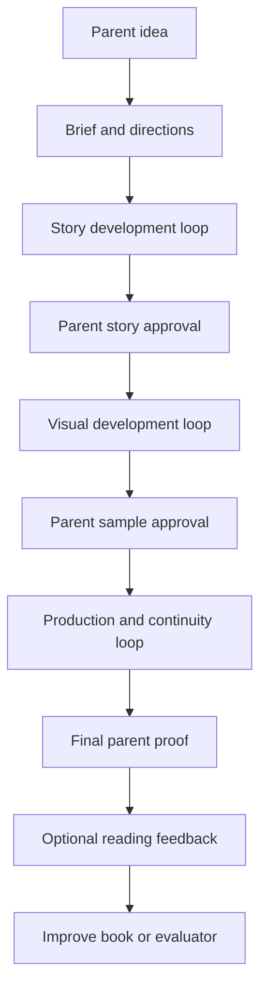
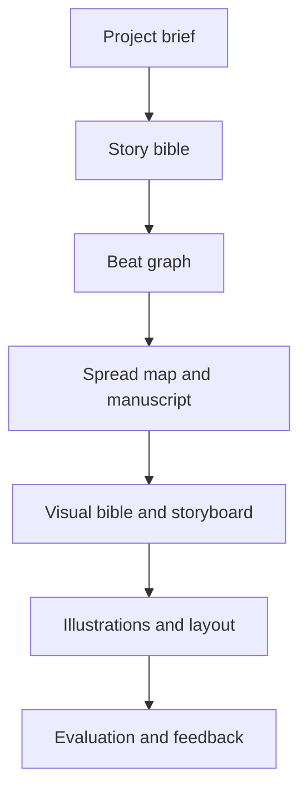
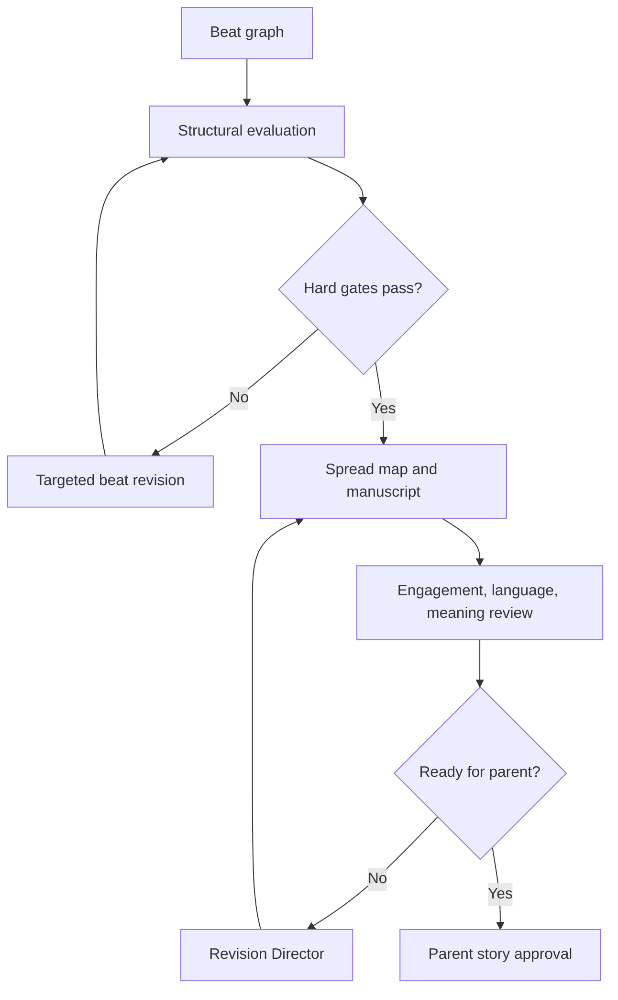
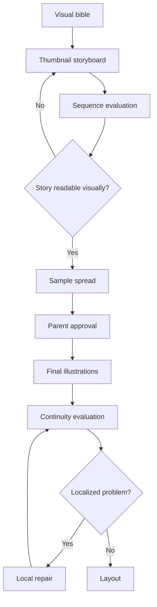

# Configurable Agent Pipeline

## Architecture

The parent sees a guided creative workflow. Internally, an orchestrator runs a directed artifact graph with conditional stages and bounded revision loops.

An **agent** is a versioned role with a strict contract. It is not necessarily a dedicated model or permanently running process. Several agents may use the same underlying LLM with different inputs, tools, and permissions.

## Overall flow



## Artifact graph



Every artifact has:

- Stable identifier
- Schema version
- Content version
- Status
- Provenance
- Parent-approved and locked fields
- Evaluation history

```yaml
artifact:
  id: beat_graph
  schema_version: 1
  content_version: 4
  status: parent_approved

  derived_from:
    project_brief: 2
    story_direction: 1

  locked_fields:
    - protagonist
    - central_conflict
    - ending_direction
```

## Agent contract

```yaml
agent:
  id: causal_structure_evaluator
  version: 1.2

  enabled_if:
    - project.story.type == narrative

  inputs:
    - story_bible
    - beat_graph
    - reader_profile

  outputs:
    - structural_evaluation

  permitted_actions:
    - evaluate
    - recommend_revision

  prohibited_actions:
    - silently_rewrite_story
    - change_parent_intent

  pass_rules:
    hard_gates:
      - protagonist_has_goal
      - ending_resolves_central_conflict
    minimum_scores:
      causal_coherence: 2.5
      escalation: 2.5

  maximum_automatic_iterations: 3
  on_failure: revision_director
  on_repeated_failure: request_review
```

## Agent registry

### Foundation

| Agent | Reads | Produces |
|---|---|---|
| Project Orchestrator | Configuration and artifact statuses | Execution plan and state transitions |
| Parent Intent Agent | Parent input | `ProjectBrief` |
| Idea Expansion Agent | Brief and template options | Two or three `StoryDirections` |
| Scope Agent | Direction, page count, reading mode | Narrowing or format recommendation |

### Story creation

| Agent | Reads | Produces |
|---|---|---|
| Story Engine Agent | Approved direction and template registry | Story architecture |
| Character Agent | Direction, reader profile, boundaries | Character records and relationship map |
| Causal Beat Agent | Architecture and characters | `BeatGraph` |
| Spread Planner | Beat graph and format | `SpreadMap` |
| Manuscript Agent | Spread map and reader profile | Narration and dialogue by spread |

### Story evaluation

| Agent | Primary responsibility |
|---|---|
| Structural Evaluator | Causality, escalation, choice, resolution |
| Character Evaluator | Desire, agency, consistency, emotional change |
| Engagement Evaluator | Hook, curiosity, pattern, rhythm, payoff |
| Language Evaluator | Mode fit, vocabulary, syntax, cohesion, inference |
| Meaning Evaluator | Optional value integration and non-preachiness |
| Safety Evaluator | Age suitability and harmful content |
| Representation Evaluator | Stereotypes, identity, cultural context |

### Visual creation and evaluation

| Agent | Reads | Produces |
|---|---|---|
| Visual Director | Story bible, spread map, art preference | Art direction |
| Character Design Agent | Character records and art direction | Model sheets and expressions |
| World Design Agent | Locations, props, motifs | World reference assets |
| Storyboard Agent | Spread map and visual bible | Thumbnail sequence |
| Visual Narrative Evaluator | Storyboard and manuscript | Sequence evaluation |
| Sample Spread Agent | Approved storyboard frames | Parent-facing visual sample |
| Illustration Agent | Approved references and spread specs | Final-resolution art |
| Continuity Evaluator | Illustration sequence and fact graph | Localized continuity report |
| Local Repair Agent | Approved image and repair mask/spec | Repaired region or spread |

### Production and feedback

| Agent | Reads | Produces |
|---|---|---|
| Typography Agent | Reader profile, language, format | Typography system |
| Layout Agent | Manuscript, illustrations, typography | Book layout |
| Production Preflight Agent | Layout and export target | Hard-check report |
| Holistic Book Evaluator | Complete proof and all config | Readiness profile |
| Export Agent | Approved proof and provider config | Screen or print files |
| Reading Feedback Agent | Optional parent observations | Structured feedback summary |

## Story loop



## Visual loop



## Revision Director

The Revision Director reconciles reports but does not freely rewrite artifacts.

```yaml
revision_plan:
  target_artifact: manuscript_5

  preserve:
    - Maya's fear of disappointing her friend
    - rooftop kite-launch setting
    - final cooperative repair

  priority_changes:
    - id: R1
      problem: attempts_2_and_3_do_not_escalate
      affected_spreads: [5, 6]
      assigned_to: causal_beat_agent

    - id: R2
      problem: ending_explains_honesty_directly
      affected_spreads: [12]
      assigned_to: manuscript_agent

  prohibited_changes:
    - change_protagonist
    - replace_parent_approved_ending_direction

  rerun_evaluators:
    - structural_evaluator
    - meaning_evaluator
```

Revision priorities:

1. Safety and production blockers
2. Structural hard gates
3. Comprehension failures
4. Visual continuity failures
5. Engagement and meaning weaknesses
6. Polish

## Parent checkpoints

| Checkpoint | Parent sees | Parent action | Downstream lock |
|---|---|---|---|
| Intent | Concise interpretation of the idea | Confirm or correct | Goal, audience, boundaries |
| Directions | Two or three different story engines | Choose or combine | Core engine and promise |
| Story | Characters, ending direction, spread outline | Approve or request changes | Character identities and story arc |
| Visual identity | Character options and art direction | Choose and lock | Reference assets and style config |
| Sample spread | One or two near-final spreads | Approve visual treatment | Layout and rendering approach |
| Full proof | Complete book | Approve or comment by page | Export version |

Parents may reopen a checkpoint. The system should show which later artifacts will become stale.

## State machine

```yaml
artifact_states:
  - draft
  - evaluating
  - revision_requested
  - awaiting_parent
  - parent_approved
  - stale
  - production_locked
```

Example transition:

```yaml
transition:
  from: parent_approved
  to: stale
  when:
    - an_upstream_locked_field_changes
  action:
    - identify_affected_artifacts
    - preserve_unaffected_assets
    - request_regeneration_approval_if_costly
```

## Loop controls

```yaml
loop_policy:
  story_structure:
    maximum_iterations: 3
    minimum_score_improvement: 0.25

  manuscript:
    maximum_iterations: 3

  illustration:
    local_repairs_before_full_regeneration: 2

  on_no_improvement: request_review
  on_evaluator_disagreement: revision_director
```

Rules:

1. Every revision cites evidence.
2. Every revision names what to preserve.
3. Only affected evaluators rerun initially.
4. Holistic regression evaluation runs before approval.
5. Automatic loops stop at the configured limit.
6. Parent-approved fields cannot be silently changed.

## Image-provider adapter

```yaml
generation_request:
  spread_spec: spread_7
  art_direction: warm_handmade_v1
  character_references:
    - maya_reference_v3
    - friend_reference_v2
  location_reference: school_rooftop_v1
  previous_spread_reference: spread_6_approved

  continuity_requirements:
    - maya_has_green_satchel
    - kite_is_torn_lower_left

  output:
    aspect_ratio: landscape_spread
    text_rendering: none
    text_safe_area: upper_left
```

Provider implementations may use reference conditioning, adapters, fine-tuning, consistent attention, seeds, editing, or human illustration. The pipeline contract remains stable.

## Observability

Record per agent run:

- Agent and prompt/config version
- Input artifact versions
- Output artifact version
- Model or deterministic tool version
- Token, image, and compute cost
- Latency
- Evaluator scores before and after revision
- Parent acceptance or rejection
- Repair versus regeneration decision

This supports debugging, cost control, and evidence-based improvement.
