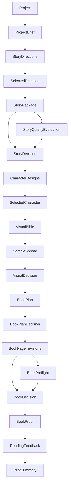
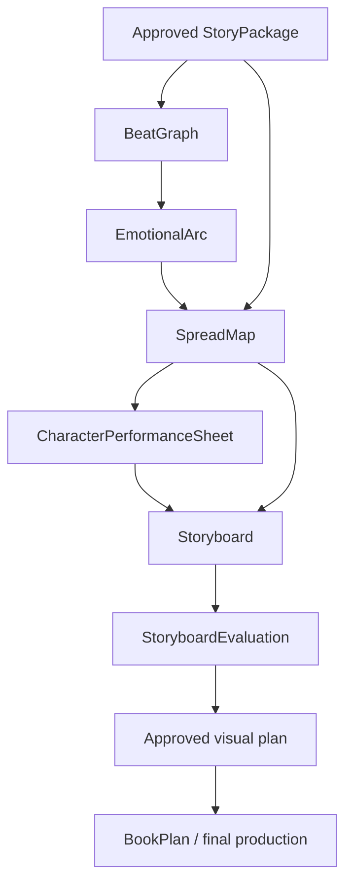

# Artifact Catalog

This catalog is the contributor-facing map of the structured outputs that move a
book project through the implemented V0 and the proposed next visual-narrative
stages.

It documents purpose, ownership, lineage, storage, approval, and lifecycle
expectations. It does not duplicate every schema field. The linked Zod schemas,
services, and tests remain the executable source of truth.

## How to use this catalog

Before adding or changing an artifact:

1. Find the artifact here and follow its schema and producer links.
2. Confirm its upstream inputs, downstream consumers, approval behavior, and
   staleness implications.
3. Prefer extending the artifact that owns the decision. Create a new artifact
   when the output needs an independent lifecycle, review gate, revision
   history, or downstream consumers.
4. Update this catalog when an artifact is added, removed, renamed, deprecated,
   or given a new owner or dependency.
5. Update the linked schema and tests when executable behavior changes.

## Terms and status

- **Artifact:** A validated, persisted output or decision used by another stage.
- **Asset:** A binary file referenced by an artifact, such as an image or PDF.
- **Current alias:** A stable filename containing the latest saved revision.
- **Successor:** A new numbered revision that preserves earlier work.
- **Job artifact:** Resumable operational state; it is not a creative approval.
- **Implemented:** Persisted and used by the runnable application.
- **Proposed:** A future boundary under consideration; no runtime contract exists
  until its schema, service behavior, tests, and product checkpoint are defined.
- **Deprecated:** Readable for compatibility but no longer created.

## Storage and naming

V0 stores local project data under:

```text
data/projects/<project-id>/
```

`data/` is ignored by Git. Generated family projects and provider outputs must
not be committed.

Most revisable artifacts use an immutable numbered successor plus a stable
current alias:

```text
story-01.json   # preserved revision 1
story-02.json   # preserved revision 2
story.json      # current alias
```

Some revision families use `-r01` instead:

```text
book-plan-r01.json
book-page-story-07-r02.json
proof-r01.pdf
```

Do not infer a filename pattern for new code from this catalog alone. Follow the
owning service and its tests. `FileProjectRepository` validates project-scoped
filenames and writes JSON and binary assets atomically.

## Implemented artifact flow



Job artifacts and `BookManifest` are omitted from the main creative flow because
they report operational progress rather than introduce creative decisions.

## Foundation and story workflow

Primary schema:
[`src/lib/projects/project.ts`](../src/lib/projects/project.ts). Producer:
[`StoryWorkflowService`](../src/lib/directions/story-workflow-service.ts)

| Artifact | Purpose | Inputs | Parent interaction | Storage |
| --- | --- | --- | --- | --- |
| `Project` | Identifies the local book project. | Parent-entered title | Created and reopened from the project library | `project.json` |
| `ProjectBrief` | Preserves the original idea, protagonist hints, desire, desired feeling, meaning, avoid list, and must-keep details. | Project and parent intake | Parent-authored | `brief.json` |
| `StoryDirections` | Offers exactly three materially distinct story engines with promises, openings, and endings. | `ProjectBrief` | Parent reviews or requests another set | `directions-NN.json`; current `directions.json` |
| `SelectedDirection` | Records the selected direction revision and optional steering. | `StoryDirections` | Explicit parent selection | `selected-direction.json` |
| `StoryPackage` | Holds the title, character summaries, promise, beginning/middle/ending arc, and 13 spreads with beats and manuscript text. | Brief and selected direction | Parent reviews, revises, and approves | `story-NN.json`; current `story.json` |
| `StoryQualityEvaluation` | Records hidden fidelity, structure, age-fit, oral-flow, and safety checks plus a bounded revision brief. | Exact first-draft story revision | Hidden from the parent in V0 | `story-quality-evaluation-NN.json`; evaluated input in `story-quality-input-NN.json` |
| `StoryDecision` | Approves or requests changes to an exact story revision. | `StoryPackage` | Explicit parent decision | `story-decision-NN.json`; current `story-decision.json` |
| `TextGenerationJob` | Makes direction/story generation failure and recovery resumable. | Current text-stage inputs | Parent sees progress and recovery state | Stage job records and `text-generation-job.json` |

Current limitation: `StoryPackage` contains a coarse beginning/middle/ending arc
and spread beats, not independent causal-beat or emotional-arc artifacts.

## Visual workflow

Primary schema:
[`src/lib/visuals/visual-artifacts.ts`](../src/lib/visuals/visual-artifacts.ts).
Producer:
[`VisualWorkflowService`](../src/lib/visuals/visual-workflow-service.ts)

| Artifact | Purpose | Inputs | Parent interaction | Storage |
| --- | --- | --- | --- | --- |
| `CharacterDesigns` | Presents three character options tied to a story revision and art preset. | Approved story and chosen art preset | Parent regenerates or chooses an option | `character-designs-NN.json`; current `character-designs.json` |
| `SelectedCharacter` | Locks the selected option and a copied versioned reference asset. | `CharacterDesigns` | Explicit parent selection | `selected-character-NN.json`; current `selected-character.json` |
| `VisualBible` | Preserves identity invariants, props, locations, palette, safe text area, and visual avoid rules. | Story, preset, and selected reference | Reviewed through the visual checkpoint | `visual-bible-NN.json`; current `visual-bible.json` |
| `SampleSpread` | Tests the visual treatment on spread 7 while keeping text separately editable. | Story, `VisualBible`, and character reference | Parent edits text or requests an image revision | `sample-spread-NN.json`; current `sample-spread.json` |
| `VisualDecision` | Approves or requests changes to an exact sample revision. | `SampleSpread` | Explicit parent decision | `visual-decision-NN.json`; current `visual-decision.json` |
| `ImageGenerationJob` | Makes character and sample generation failure and recovery resumable. | Current visual-stage inputs | Parent sees progress and recovery state | Stage job records and `image-generation-job.json` |

Associated assets include:

- `character-option-rNN-<1..3>.<ext>`
- `character-reference-rNN.<ext>`
- `sample-spread-rNN.<ext>`

Current limitation: the visual workflow does not yet persist a whole-book
emotional arc, character performance sheet, thumbnail storyboard, or visual
narrative evaluation.

## Book-production workflow

Primary schema:
[`src/lib/production/production-artifacts.ts`](../src/lib/production/production-artifacts.ts).
Producer:
[`BookProductionService`](../src/lib/production/book-production-service.ts)

| Artifact | Purpose | Inputs | Parent interaction | Storage |
| --- | --- | --- | --- | --- |
| `BookPlan` | Plans all 16 pages with beat, text, illustration intent, continuity facts, required references, and text-safe area. | Approved story, character reference, Visual Bible, sample, and family details | Parent edits and approves the exact plan | `book-plan-rNN.json`; current `book-plan.json` |
| `BookPlanDecision` | Gates paid production on an exact plan revision. | `BookPlan` | Explicit parent approval | `book-plan-decision-rNN.json`; current `book-plan-decision.json` |
| `BookPage` | Preserves one generated page revision, its source revisions, image reference, text, continuity inputs, instructions, model, and cost. | Approved plan and visual references | Parent keeps, edits text, or requests targeted regeneration | `book-page-<page-id>-rNN.json`; current `book-page-<page-id>.json` |
| `BookManifest` | Summarizes existing pages, spend, production status, and preflight state. | Saved pages and production state | Drives review/recovery UI | `book.json` |
| `BookProductionJob` | Records progress, completed units, current/failing page, budget, last safe artifact, and activity. | Approved plan and page generation | Parent pauses, resumes, or recovers | `book-production-job.json` |
| `BookPreflight` | Checks required pages, text, character references, reference details, and continuity facts. | Current 16-page set | Parent sees pass or actionable failures | `book-preflight.json` |
| `BookDecision` | Approves the exact current revision of all 16 pages. | Current pages and source story/sample/plan revisions | Explicit parent approval | `book-decision-rNN.json`; current `book-decision.json` |

Generated page image filenames are referenced by each `BookPage`; the filename
is part of the validated artifact rather than a separate global naming
contract.

Current limitation: `BookPlan` is the closest implemented artifact to a spread
map, but it does not explicitly model emotional before/after state, page-turn
question, shot/composition plan, character performance, or sequence rhythm.

## Proof and learning workflow

Primary schema:
[`src/lib/proof/proof-artifacts.ts`](../src/lib/proof/proof-artifacts.ts).
Producer:
[`BookProofService`](../src/lib/proof/book-proof-service.ts)

| Artifact | Purpose | Inputs | Parent interaction | Storage |
| --- | --- | --- | --- | --- |
| `BookProof` | Binds the proof to exact page revisions and records HTML/PDF and layout-check status. | `BookDecision` and the exact 16 pages | Parent reads and exports | `book-proof-rNN.json`; current `book-proof.json` |
| `ReadingFeedback` | Captures favorite part, confusion, completion, fidelity, reread interest, and sequel interest. | Exact proof revision and family observation | Optional parent submission | `feedback-rNN.json`; current `feedback.json` |
| `PilotSummary` | Derives completion time, regeneration count, estimated cost, fidelity, and interest signals. | Project, production state, and `ReadingFeedback` | Used for pilot learning | `pilot-summary.json` |

Associated proof assets use:

- `proof-rNN.html` and current `proof.html`
- `proof-rNN.pdf` and current `proof.pdf`

## Proposed visual-narrative artifacts

These are candidate boundaries for the next visual-narrative vertical slice.
They are not implemented contracts, approved schemas, or permission to add all
of them in one change.



| Proposed artifact | Decision it would own | Likely producer | Likely consumers | Candidate parent interaction |
| --- | --- | --- | --- | --- |
| `BeatGraph` | Cause, action, consequence, escalation, choice, and resolution for each beat | Story/beat planning stage | Emotional arc and spread planning | Review with the story; approval policy unresolved |
| `EmotionalArc` | Character-by-character emotional state and change across beats | Visual narrative planning stage | Spread map, character performance, storyboard, meaning evaluation | Editable summary; approval policy unresolved |
| `SpreadMap` | Story job, visual job, text job, before/after state, page turn, and continuity needs per spread | Spread planning stage | Manuscript, storyboard, and book plan | Editable sequence; likely approval before paid art |
| `CharacterPerformanceSheet` | Pose, expression, gesture, movement, silhouette, and prohibited-performance vocabulary needed by the whole story | Character performance/design stage | Storyboard and illustration | Visual review alongside character identity |
| `Storyboard` | Whole-book thumbnail sequence, composition, viewpoint, rhythm, and visual causality | Storyboard stage | Visual evaluation and sample generation | Review before polished sample/final art |
| `StoryboardEvaluation` | Evidence about visual readability, emotional clarity, repetition, page turns, and text-image cooperation | Visual narrative evaluator | Revision planning and approval gate | Usually summarized, with actionable evidence |

Before implementing any proposed artifact, resolve:

- whether it is story-owned, visual-owned, or jointly owned;
- whether the parent edits, selects, approves, or only sees a summary;
- its schema and storage naming;
- its source revision identifiers;
- what becomes stale when it changes;
- whether an existing artifact should be narrowed to avoid duplicate authority.

## Approval and staleness

Implemented exact-revision decisions currently gate:

- story approval through `StoryDecision`;
- visual treatment through `VisualDecision`;
- production spending through `BookPlanDecision`;
- the complete page set through `BookDecision`.

A decision applies only to the artifact revision it names. Successors preserve
prior revisions rather than silently rewriting them.

The intended dependency rule is:

> An upstream successor makes only dependent downstream artifacts stale while
> preserving unrelated and previously approved work.

General dependency-derived staleness is not yet fully implemented. The current
task status in [`tasks/mlp-v0.md`](../tasks/mlp-v0.md) remains authoritative for
that limitation. Contributors must not claim lifecycle-wide automatic
staleness until schemas, services, and tests enforce it.

## Ownership index

| Concern | Canonical source |
| --- | --- |
| Artifact purpose, lineage, ownership, and status | This catalog |
| Future agent roles and conditional loops | [`04-agent-pipeline.md`](04-agent-pipeline.md) |
| Parent-visible checkpoints and change consequences | [`08-ux-guidelines.md`](08-ux-guidelines.md) |
| Executable artifact fields | Linked Zod schema files |
| Runtime creation and filenames | Linked workflow services and tests |
| Local persistence boundary | [`development.md`](../development.md) and `FileProjectRepository` |
| Implementation completion and known gaps | [`tasks/mlp-v0.md`](../tasks/mlp-v0.md) |
