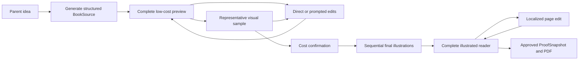

# Proposed Artifact-First Book Experience

**Status:** Proposed for product and architecture review

**Decision requested:** Whether V0 should replace its checkpoint-heavy parent
journey with a complete-preview-first experience

**Last updated:** 2026-07-22

## Summary

The current V0 exposes the sequence used to make a book: idea, alternative
directions, story approval, visual identity and sample approval, book-plan
approval, production, and final proof. This is safe and inspectable, but it asks
the parent to participate in the production pipeline before they have seen a
complete book.

This proposal makes the current editable book the center of the product:

1. A parent describes the idea and details that must be preserved.
2. The system quickly materializes a complete, low-cost book preview.
3. The parent edits concrete pages or asks for book-level changes.
4. The system generates representative visual samples before expensive work.
5. The parent confirms cost, generates final illustrations, and approves a
   proof snapshot.

The application should continue to store briefs, evaluations, visual rules,
continuity facts, generation jobs, and provenance. Most become internal
artifacts instead of mandatory parent-facing checkpoints.

This is a proposed direction, not an accepted change to the current MVP
decisions in [README.md](README.md).

## Why reconsider the current journey

The checkpoint-heavy flow was designed to protect parent intent, avoid costly
regeneration, and preserve approved work. Those goals remain valid. The open
question is whether every protective artifact also needs its own screen and
approval.

The current experience has three product risks:

- **Delayed value:** the parent reviews production abstractions before seeing
  the book they came to make.
- **Decision burden:** choosing among story engines, approving a story package,
  and inspecting a book plan may feel like work delegated back to the parent.
- **Pipeline coupling:** if the project is primarily a record of pipeline
  checkpoints, editing an older book appears to require keeping its original
  generation pipeline executable indefinitely.

The alternative is to treat the generation pipeline as a way to create and
edit a durable book source, not as the durable product itself.

## Relevant product pattern

AI application builders offer a useful analogy. Lovable maintains an editable
codebase and version history, lets a user preview or revert prior working
versions, and treats publishing as a separate snapshot. It may use planning and
agent steps internally, but the primary editing surface is the working website,
not each intermediate implementation artifact.

The analogous objects for this product are:

| Application builder concept | Kids Book Builder concept |
| --- | --- |
| Editable source code | Structured `BookSource` |
| Working website preview | Complete low-cost book preview |
| Source version history | Book-source and asset revision history |
| Published deployment | Approved `ProofSnapshot` and PDF |
| Visual or prompted edit | Direct text edit or scoped book change |
| Agent traces and plans | Internal generation artifacts and provenance |

This analogy does not imply that a book is technically equivalent to a website.
Illustrations are slower and more expensive to regenerate than most code edits,
and character continuity makes partial replacement harder. Those differences
justify a visual sample and cost gate before final production.

## Product hypothesis

> Parents want to see a recognizable complete book as quickly as possible and
> then refine concrete pages. They do not primarily want to participate in a
> book-production pipeline.

The V0 experience should optimize for **time to first complete book**, while
retaining explicit confirmation before expensive illustration work and final
approval.

This hypothesis must be tested with parents. It should not be promoted to a
settled product rule solely from internal preference.

## Proposed parent experience

### 1. Describe

The parent provides:

- The original idea
- Protagonist or important characters
- Details the book must keep
- Desired feeling or optional value/question
- Content to avoid
- An optional curated visual preference

The application may ask a small number of clarifying questions when a missing
answer materially affects the result. It should not require the parent to
select a formal story engine.

### 2. Review and refine a complete preview

One bounded generation operation produces a structured draft containing:

- Title and story promise
- Character records
- Complete 13-spread manuscript
- Illustration intent for every required page
- Continuity and must-show facts
- Proposed visual direction
- Text-safe-area and layout information

The parent immediately sees a complete reader and contact sheet. Before paid
illustration work, pages use real editable text with inexpensive visual
representations such as layout blocks, scene cards, or deterministic
placeholders.

The parent can:

- Edit text directly
- Request a change to one page
- Request a book-level change such as a funnier tone or different ending
- Ask to explore alternatives when dissatisfied
- See which existing work a broad change would affect

The system may still create alternative directions and run evaluations
internally. They are not mandatory parent approvals.

### 3. Validate the visual direction

When the structured book feels right, the system generates only enough paid
visual work to validate the expensive assumptions:

- Character reference options
- One representative story illustration
- Optionally a cover or one additional high-risk scene

The parent confirms the recurring character and visual treatment. The
application explains that this approval controls future illustrations without
exposing the full Visual Bible.

### 4. Illustrate and finish

The application shows the estimated cost and obtains required confirmation. It
then generates and saves final illustrations sequentially using the approved
character reference, book source, and continuity facts.

The parent reviews the complete illustrated reader, makes localized edits where
possible, approves the exact current page revisions, and exports the matching
proof.

## Parent-visible decision rule

Expose an intermediate decision when at least one of these is true:

1. The parent has information the system cannot infer safely.
2. The next action incurs meaningful cost or waiting time.
3. A wrong choice would invalidate substantial approved work.
4. The decision is emotionally or creatively important to the family.

Under this rule, the default experience exposes:

- Original idea and must-keep details
- Complete book preview
- Main character and representative visual sample
- Cost and scope before full illustration
- Complete proof and localized edits

The default experience hides or makes optional:

- Story-engine alternatives
- Formal story arc and evaluator reports
- Visual Bible fields and continuity records
- Prompt, model, and pipeline settings
- Production internals beyond useful progress, recovery, and cost information

## Durable system model

The design distinguishes four objects.

### `BookSource`

The current, editable materialized source of the book. It contains everything a
future editor needs without replaying the original creation pipeline.

```yaml
book_source:
  schema_version: 1
  project_id: project_123
  revision: 4

  family_brief:
    original_idea: A child and their dog build a moon garden.
    must_keep:
      - Grandma's red bicycle

  title: The Moon Garden
  characters: []
  visual_direction: {}
  character_references: []

  pages:
    - id: story_01
      text: The first page's editable text.
      illustration_intent: The child discovers a glowing seed.
      must_show: []
      continuity_facts: []
      current_image_revision: null
```

The exact schema remains an engineering design task. It should compose or
reference the existing validated brief, story, Visual Bible, book plan, and
page artifacts rather than duplicating conflicting sources of truth.

### `PipelineRecipe`

An immutable description of how a generation pipeline was configured. It may
record step identifiers, prompt versions, models, experiment-safe request
parameters, output contracts, and the compatible runner contract.

The complete recipe used to create a revision is attached to the project for
provenance and diagnosis. A movable default may select a recipe for new
projects, but must not silently rewrite existing project history.

### `GenerationRun`

The record of one generation or editing operation. It identifies:

- Pipeline recipe and step
- Input artifact revisions
- Prompt version
- Model and request settings
- Output artifact revision
- Timing, status, and cost

Artifacts retain their originating generation metadata even after the project
adopts a newer recipe.

### `ProofSnapshot`

An immutable approval of the exact current page revisions. It is analogous to
a published deployment: later edits create a new working state and make the
approval stale without changing the approved proof.

## Lifecycle



Internal evaluations and successor artifacts remain part of generation and
editing even though they are not separate nodes in the parent journey.

## Editing and compatibility use cases

### Change one sentence

Update the text in `BookSource`, create a successor page revision, and rerender
the reader and proof. Preserve the illustration. No model call or historical
pipeline is required.

### Regenerate one illustration

Use the current compatible image editor with the page specification, current
image, character reference, adjacent-page references, requested change, and
preserve instructions. Create one successor image and retain approved siblings.

The new artifact records its current recipe; it does not claim to have been
created by the historical recipe.

### Change the ending

Update only the affected book-source pages, show the complete inexpensive
preview, and identify which illustrations became stale. Obtain confirmation
before regenerating affected paid assets.

### Change the protagonist throughout

Treat this as a broad dependency change. Update the canonical character record,
identify every affected page and reference, show a revised inexpensive preview,
and obtain explicit cost confirmation before replacing illustrations.

### Open a project made by an older pipeline

Keep its current source, assets, history, and proof readable. Migrate the stable
`BookSource` contract forward when necessary. Future edits use a current
compatible editor and record new provenance.

Exact reproduction with the original pipeline is best-effort because provider
models may be retired. If an old recipe cannot execute, the application must
not silently substitute a different model while reporting the old provenance.

## Pipeline versioning policy

Attaching the recipe to the project supports reproducibility but does not imply
infinite runtime support.

The proposed policy is:

- Immutable recipes document how artifact revisions were generated.
- New projects resolve the current default recipe at creation.
- Existing artifact revisions never have their recipe rewritten.
- Stable book-source schemas receive explicit forward migrations.
- Future edits may use a newer compatible recipe against the current source.
- A runner may support a bounded range of recipe contracts.
- Unsupported generation is reported clearly and requires an explicit upgrade.
- Existing source, assets, and proofs remain readable even when their original
  generation recipe is no longer executable.

This makes **continued editability** the primary promise and **exact historical
regeneration** a secondary, best-effort capability.

## Proposed V0 scope

The smallest meaningful validation slice is:

1. Keep one code-owned journey rather than introducing a general workflow/DAG
   interpreter.
2. Materialize one validated, complete `BookSource` from the family brief.
3. Show the full text and all required pages in a low-cost reader/contact sheet
   immediately after generation.
4. Support direct text edits and at least one scoped prompted change.
5. Generate a bounded character/reference sample before full production.
6. Retain the existing cost gate, sequential saves, localized regeneration,
   exact-revision proof approval, and PDF export.
7. Define a validated, immutable pipeline-recipe format for model, parameter,
   and prompt experimentation.
8. Attach the resolved recipe to each new project and provenance to generated
   revisions.
9. Treat existing prototype data as disposable or provide one development-only
   conversion; no external customers currently depend on it.

### Explicitly out of scope for V0

- General-purpose configurable DAG execution
- Customer-facing prompt or model controls
- Pipeline editor or experiment dashboard
- Automatic cross-contract pipeline migrations
- Indefinite support for old models or runners
- Regenerating sixteen paid illustrations after every parent edit
- Remote prompt registry or hosted workflow infrastructure

## Validation plan

Before replacing the current journey, test both concepts with parents using the
same story brief:

### Concept A: checkpoint journey

The current directions, story, visual sample, plan, and proof checkpoints.

### Concept B: complete-preview journey

Idea intake followed by a complete low-cost reader, concrete editing, visual
sample, production, and proof.

Observe and ask:

- Time until the parent feels they have made a book
- Whether the parent recognizes the original idea and must-keep details
- Which intermediate choices feel useful versus burdensome
- What the parent tries to change first
- Whether a low-cost preview is sufficient before visual spending
- Whether the parent understands the scope and cost of broad versus local edits
- Where the parent hesitates, abandons, or asks for explanation

The initial goal is directional evidence, not statistical significance. Five
to eight facilitated sessions can reveal major usability failures before
implementation expands.

## Risks and mitigations

| Risk | Mitigation |
| --- | --- |
| A complete first draft feels generic or wrong | Keep must-keeps persistent and offer concrete whole-book revision immediately. |
| Removing direction choice reduces creative agency | Offer “Explore alternatives” as an optional branch from the complete preview. |
| One large text call produces internally inconsistent pages | Retain structured schemas, hidden evaluation, and at most one bounded repair before display. |
| Low-cost placeholders create false expectations about final art | Label them clearly and show representative generated visual samples before purchase. |
| Broad edits accidentally invalidate paid work | Compute dependency impact, preserve unaffected artifacts, and confirm cost before regeneration. |
| `BookSource` becomes a duplicate source of truth | Compose existing versioned artifacts or designate one canonical aggregate with tested derivation rules. |
| New editors change old books unexpectedly | Create successor revisions, show a diff/impact summary, and retain exact artifact provenance. |

## Decisions requested from review

1. Should the default parent journey optimize for a complete preview rather
   than mandatory direction and story-package approvals?
2. Which visible gate is the minimum acceptable protection before paid image
   generation: character reference, one representative page, or more?
3. Should alternative story directions remain an optional action or be removed
   from V0?
4. Is continued editability through the current compatible editor an acceptable
   promise, with exact historical regeneration treated as best-effort?
5. Should `BookSource` become a canonical aggregate, or should the UI derive the
   complete book view from the existing artifact graph?
6. What evidence from parent sessions is required before replacing the current
   five-checkpoint implementation?

## Architecture impact if accepted

**Updated.** Implementing this proposal would change the parent journey,
application-service responsibilities, persisted project contracts, generation
provenance, and compatibility policy. Acceptance would require coordinated
updates to:

- [ARCHITECTURE.md](../ARCHITECTURE.md)
- [Agent pipeline](04-agent-pipeline.md)
- [Product configuration](05-product-configuration.md)
- [Parent experience guidelines](08-ux-guidelines.md)
- The active task and acceptance scenarios
- Project, artifact, pipeline-recipe, and generation-run schemas
- Unit, integration, and parent-visible Playwright evidence

This design-only proposal does not itself change runtime architecture.

## Product-pattern references

- [Lovable project overview and version history](https://docs.lovable.dev/introduction/getting-started)
- [Lovable publishing snapshots](https://docs.lovable.dev/features/publish)
- [Lovable code editing](https://docs.lovable.dev/features/code-mode)
- [AWS Step Functions versions and aliases](https://docs.aws.amazon.com/step-functions/latest/dg/concepts-cd-aliasing-versioning.html)
- [LangSmith prompt versions and environment tags](https://docs.langchain.com/langsmith/manage-prompts)
