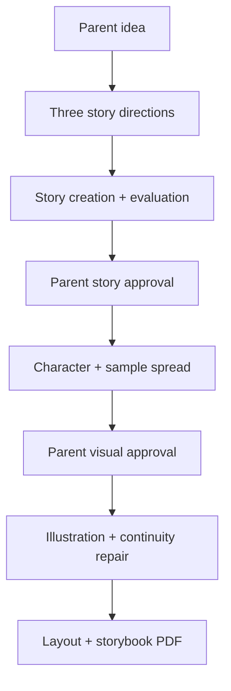

The MLP should be:

> A parent turns one original family or child idea into a polished, personalized, illustrated 32-page storybook PDF that they can read aloud that evening.

The “lovable” part is not the agent pipeline. It is the moment when the child recognizes their idea, character, interest, or family detail inside a real-looking book.

## Parent experience

### 1. Share an idea

The parent provides:

* The original idea
* Who the story follows
* What the character wants
* Desired feeling: funny, mysterious, adventurous, emotional
* Optional value or educational goal
* Anything to avoid

Defaults:

* Ages 7–10
* Parent read-aloud
* About 10 minutes
* 32 physical pages / approximately 13 story spreads
* English

### 2. Choose a story direction

The system confirms its understanding and produces three genuinely different directions.

For example:

> “A moon has lost its light.”

* A child goes on a mission to recover it.
* The moon tries increasingly ridiculous ways to glow.
* The moon is hiding because it feels it no longer belongs.

The parent selects one, combines ideas, or asks for alternatives.

### 3. Approve the story

The parent sees a simple preview containing:

* Main characters
* Story promise
* Beginning, middle and ending
* A short spread-by-spread outline
* A few representative lines

Internally, the story has already passed structure, engagement, language, meaning, and safety evaluation loops.

### 4. Choose the visual identity

Show:

* Two or three character designs
* Curated art directions
* One finished sample spread containing text and illustration

For the first version, use the six art presets already in the specification rather than unrestricted style prompting.

### 5. Receive the complete book

Generate:

* Cover and title page
* Approximately 12–14 story spreads
* Consistent recurring characters and props
* Editable text placed separately from the artwork
* Screen-quality PDF
* Page-level “keep this” or “change this” controls
* Final downloadable proof

Do not include print ordering initially. A good PDF that the family can read on a tablet or print themselves is sufficient.

## Internal MLP pipeline

The initial agent set can be logically separate roles while sharing the same underlying models:

* Parent Intent
* Direction Generator
* Story Engine
* Character and Beat Planner
* Spread Planner
* Manuscript Writer
* Story Evaluators
* Revision Director
* Visual Director
* Character/World Reference Builder
* Illustration Generator
* Continuity Evaluator
* Layout and PDF Export

We should not build these as independent services yet. Implement them as versioned stages producing structured artifacts such as `ProjectBrief`, `StoryDirection`, `BeatGraph`, `SpreadMap`, `Manuscript`, `VisualBible`, and `BookProof`.

## Visible starting choices

Use the five templates already specified:

1. Something strange is happening
2. A mission with obstacles
3. Try, fail, change the plan
4. Two sides of the same problem
5. A feeling changes shape
6. Help me choose
7. Start from scratch

Nonfiction, bilingual books, rhyming books, and almost-wordless books should wait because each requires specialized evaluation.

## What makes this an MLP rather than only an MVP

A story-text generator is merely the technical vertical slice. The MLP must include:

* Preservation of the parent’s original idea
* Meaningfully different story directions
* A recurring, visually recognizable character
* One excellent sample spread before full generation
* A complete book-shaped PDF
* Easy local revision without restarting the whole project
* A lightweight family feedback moment after reading

After reading, ask:

* What was your child’s favorite part?
* Was anything confusing?
* Did they want to know what happened next?
* Would they read it again or want another story with this character?

## Explicitly exclude

For the first launch:

* Ages 3–5
* Independent-reading guarantees
* Bilingual production
* Rhyming and meter
* Verified nonfiction
* Audiobooks and animation
* Public sharing or marketplace
* Automatic printing
* Child-photo likeness generation
* Raw agent controls or evaluator scores

## Pilot success test

Test with 8–12 parents you can personally reach. The product is promising if:

* Parents say the resulting book still feels like their idea.
* Most parents reach a completed book without needing prompt-writing knowledge.
* Children want to finish the story.
* Several children request a reread, sequel, or another story with the character.
* Parents voluntarily want to create a second book.

So the first build should be an end-to-end **“idea to read-aloud PDF” experience**, not the entire configurable publishing platform. The underlying artifacts and stages remain configurable so we can later add younger ages, educational books, bilingual adaptations, printing, and other modes.
