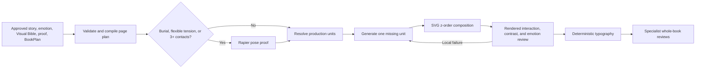

# Illustration production pipeline

This module turns approved book artifacts into deterministic, provider-neutral
page work orders. It does not generate story text, redesign approved characters,
or approve a rendered page.



The input schema enforces the production decisions that prevent the common
failure modes found in the Turnip prototype:

- exactly one focal region and a compressed background contrast budget;
- principal-character intensity mostly in the 2–5 range, with a hard ceiling
  of 8;
- interaction modules for grips and body holds;
- anchored plates for buried props;
- Rapier proofs for buried geometry, flexible tension, and long contact chains;
- one missing asset generation request at a time;
- deterministic typography after artwork, with at least 4.5:1 contrast.

Compile a new book plan with:

```sh
pnpm illustration:compile -- --input path/to/illustration-plan.json --output data/projects/<project-id>/illustration-run
```

[`examples/illustration-pipeline/minimal-book-plan.json`](../../../examples/illustration-pipeline/minimal-book-plan.json)
is a valid one-page starting point. The compiler refuses to overwrite an
existing run directory's plan or checklist, so successor runs need a new run
directory.

The command writes a compiled book plan, one work-order JSON file per page, and
a review checklist. Provider adapters and the existing SVG/Rapier primitives
consume those work orders; a successful geometry proof never substitutes for
review of the rendered raster.
