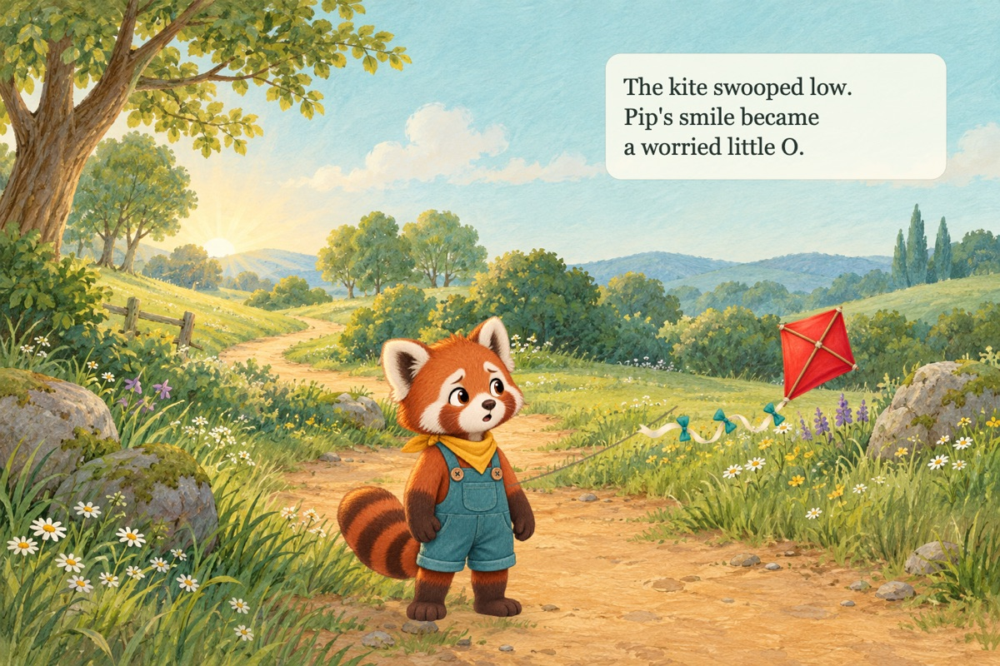
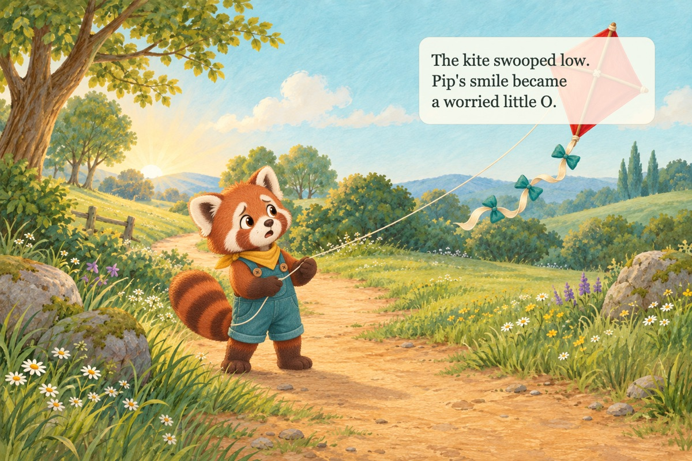

# Layered illustration stitcher prototype

Status: prototype for review; not wired into the product runtime

## Question

Can a children's-book page be assembled from reusable generated assets so that
most page-to-page changes require only a new expression, pose, or prop instead
of regenerating the complete illustration?

The working hypothesis was that LLM image models are strong at bounded visual
tasks but less reliable at preserving a complete page's character identity,
environment geometry, prop details, and text-safe composition across a book.

## What this PR adds

- A small TypeScript scene model and SVG compositor with runtime validation.
- Bitmap, ellipse, path, and deterministic text-box layers.
- Asset-root containment, PNG validation, alpha checks for cutouts, file-size
  limits, and per-asset SHA-256 provenance.
- A Playwright renderer that turns each composed SVG into a 1536 x 1024 PNG.
- A five-page local demo, including a controlled comparison between layered
  assembly and one full-page image-generation call.
- The exact image prompts, generation timings, reusable inputs, representative
  outputs, and a detailed comparison report.

The reproducible prototype inputs and the prompt ledger live in
`tasks/examples/layered-stitcher/`. Generated render output remains under the
ignored `data/` tree in accordance with the local-development contract.

Run the demo with:

```sh
pnpm demo:stitcher
```

The renderer writes PNG, SVG, and provenance outputs to
`data/prototypes/layered-stitcher/output/`. SVG files are intentionally not
committed because the prototype embeds PNGs as data URLs, making each SVG
several megabytes without adding review value.

## Controlled comparison

The page-four story beat was held constant: the kite swoops and Pip changes from
curious/happy to mildly worried. Both variants use the same approved meadow,
standing-character reference, red kite, target size, story text, and text-box
coordinates.

### Layered assembly

The background and kite are reused byte-for-byte. Only the worried Pip cutout
was generated, then the TypeScript compositor positioned the assets and rendered
the kite string, contact shadow, and text.



### Single-prompt page

One full-page generation received the background, standing Pip, and kite as
references. The exact same deterministic text layer was added afterward so text
rendering was not a model-quality confound.



## What we observed

| Criterion                  | Layered assembly                                                       | Single-prompt page                                                                            |
| -------------------------- | ---------------------------------------------------------------------- | --------------------------------------------------------------------------------------------- |
| Background continuity      | Exact bitmap and hash reused                                           | Convincing but detailed branches, flowers, rocks, bushes, and path edges were redrawn         |
| Character identity         | Closer face, proportions, scale, and clothing continuity               | Recognizably Pip, with small face and head-silhouette drift                                   |
| Emotion                    | Mild worry is readable and age-appropriate                             | Mild worry is readable and reinforced by the body pose                                        |
| Character/prop interaction | Weaker: the reused relaxed hand does not clearly grip the string       | Stronger: hands, line tension, gaze, and torso form one coherent action                       |
| Kite continuity            | Exact approved kite reused                                             | Recognizable redraw retaining the defining traits                                             |
| Text-safe composition      | Deterministic; the kite remains outside the box                        | Failed; the generated kite occupies the requested text-safe region and is obscured by the box |
| Lighting/contact           | Acceptable manual shadow, with a slight cutout feel                    | Better whole-scene lighting, contact shadow, and physical integration                         |
| Editability                | Character, prop, string, shadow, and text remain independently movable | Art is one opaque raster and requires regeneration or retouching to change                    |

No character or environment/prop hard gate failed. The focused reviews rate both
variants as usable with light revision, for different reasons: the layered page
needs a true string-holding pose when ownership matters, while the full-page
version needs identity and safe-area correction.

## Cost and latency

The built-in generation tool did not expose model, quality, token usage, or
invoice cost, so this experiment does not claim an exact billed amount.

Measured locally:

| Path                                   | Generation calls | Generation time |       Local composition |
| -------------------------------------- | ---------------: | --------------: | ----------------------: |
| Layered, actual run                    |                2 |        65.395 s |                 0.456 s |
| Layered, accepted retry only           |                1 |        42.270 s |                 0.456 s |
| Single-prompt                          |                1 |        39.931 s |                 0.395 s |
| Another page reusing the worried layer |                0 |             0 s | approximately 0.4-0.5 s |

The first expression edit was rejected because the model rendered a checkerboard
into an opaque PNG instead of returning transparency. The compositor's alpha
gate caught it. That failure is included in the actual layered timing and call
count rather than being hidden.

For a comparable API implementation, OpenAI's current GPT Image 2 documentation
lists output-only estimates for a 1536 x 1024 image of $0.005 at low quality,
$0.041 at medium, and $0.165 at high. Text and reference-image inputs are extra.
At medium quality, this run's two layered outputs would therefore be roughly
$0.082 in output cost versus $0.041 for the one full-page output. A successful
first-pass expression edit would be roughly equal in output cost and would use
one reference image instead of three. Subsequent reuse of the accepted asset has
no image-generation cost.

Sources:

- [OpenAI image-generation guide](https://developers.openai.com/api/docs/guides/image-generation)
- [OpenAI API pricing](https://developers.openai.com/api/docs/pricing)

The practical model is:

```text
layered generation calls = unique missing backgrounds
                         + unique missing poses/expressions
                         + unique missing props

single-prompt generation calls = pages + retries
```

Layering is an amortization strategy. It is not guaranteed to be cheaper for the
first isolated page, but it becomes cheaper as approved assets recur.

## Recommendation

Use layered composition as the default for continuity-heavy children's books,
with bounded generation of missing variants. Do not restrict the library to one
full-body cutout per emotion. Add a small approved action vocabulary such as:

- `hold-string`
- `reach`
- `point`
- `hug`
- `carry`

These can be full poses initially and later become body/arm/hand overlays if the
visual seams are acceptable. Each asset should have stable anchors, alpha
validation, a content hash, and explicit allowed reuse.

Reserve full-page generation for exceptional pages where integrated hands,
occlusion, shadows, or a cinematic composition matter more than exact background
and prop reuse. A useful production pipeline would be:

1. Resolve the page into known asset IDs and required emotional/action variants.
2. Reuse approved assets whenever the required variant exists.
3. Generate only missing variants and reject outputs that fail alpha, identity,
   dimensions, or silhouette checks.
4. Compose with deterministic transforms, z-order, text-safe regions, and text.
5. Render and run continuity checks.
6. Escalate to a full-page generation only when the scene cannot be expressed by
   the asset vocabulary.

## Verification

The prototype was checked with:

```sh
pnpm demo:stitcher
pnpm test
pnpm lint
pnpm typecheck
git diff --check
```

The compositor's focused tests cover deterministic rendering, escaping untrusted
text, duplicate layer IDs, path traversal, and rejection of non-alpha character
assets. The demo report also records the content hash, dimensions, alpha state,
and page use count for every bitmap.

Observed result: 14 Vitest files and 46 tests passed; ESLint and TypeScript passed;
the demo rendered all five pages. Verification used the available Node 24.19.0
runtime, which reports an engine warning because the repository pins Node 25.9.0.
The fallback package-manager wrapper also stopped on its existing
unapproved-native-build policy, so the checks were invoked through the installed
pnpm CLI without changing that policy.

The local character evaluation manifest and output were also validated against
the repository's `evaluate-book-characters` schemas. They contain machine-local
absolute paths required by that evaluator contract, so the portable findings are
summarized here instead of committing those transient files.

Repository-wide `pnpm format:check` continues to report six pre-existing files
outside this change. All files in this PR pass targeted Prettier and ESLint checks.

## Architecture impact

None for the current application: this is an opt-in prototype and is not called
from a route, server action, domain workflow, persistence layer, or approval
lifecycle. Product integration would change runtime behavior and artifact
contracts and should receive a separate architecture/spec update before adoption.
